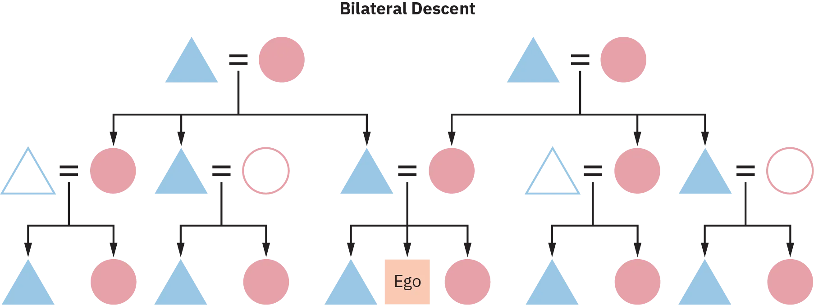

## 11.3
 
Tính toán quan hệ họ hàng giữa các nền văn hóa

### Kết quả học tập

Đến cuối phần này, bạn sẽ có thể:

- Mô tả tầm quan trọng của quan hệ họ hàng trong cấu trúc xã hội.
- Phân biệt giữa các hệ thống quan hệ họ hàng khác nhau.
- Minh họa ba hình thức quan hệ họ hàng.
Bằng cách xác định các mối quan hệ giữa các cá nhân, sự hiểu biết về văn hóa về quan hệ họ hàng tạo ra các hệ thống hoặc cấu trúc họ hàng trong xã hội. Đây là khía cạnh thể chế của quan hệ họ hàng, và nó lớn hơn chính gia đình. Trong các xã hội nhỏ hơn với dân số thấp hơn, quan hệ họ hàng đóng vai trò chính trong tất cả các thể chế xã hội. Trong các xã hội lớn hơn với dân số cao hơn, quan hệ họ hàng đặt những điều địa phương và quen thuộc vào thế đối lập với một xã hội rộng lớn, vô định hình hơn, nơi các mối quan hệ ngày càng ít ý nghĩa. Trên thực tế, quan hệ họ hàng định hình cách cá nhân và gia đình được nhìn nhận trong mối quan hệ với xã hội rộng lớn hơn và thể hiện các giá trị xã hội.

### Các loại hệ thống quan hệ họ hàng

Trong nghiên cứu ban đầu của mình, Lewis Henry Morgan đã phân biệt ba hình thức cơ bản của cấu trúc quan hệ họ hàng thường thấy giữa các nền văn hóa. Ngày nay, chúng ta gọi các hình thức quan hệ họ hàng này là quan hệ họ hàng trực hệ, phân nhánh hợp nhất và thế hệ. Mỗi hình thức xác định gia đình và người thân theo một cách hơi khác nhau và do đó làm nổi bật các vai trò, quyền và trách nhiệm khác nhau cho những cá nhân này. Điều này có nghĩa là tùy thuộc vào cấu trúc quan hệ họ hàng được một xã hội sử dụng, CÁI TÔI sẽ gọi một nhóm cá nhân khác nhau là họ hàng và sẽ có một mối quan hệ khác với những cá nhân đó.

*Quan hệ họ hàng trực hệ:* Quan hệ họ hàng trực hệ (ban đầu được gọi là *quan hệ họ hàng Eskimo*) là một hình thức *tính toán* quan hệ họ hàng (một cách ánh xạ CÁI TÔI với các cá nhân khác) làm nổi bật gia đình hạt nhân. Trong khi họ hàng trong hệ thống trực hệ được truy nguyên qua cả mẹ và cha của CÁI TÔI (một thực hành gọi là dòng dõi song hệ), thuật ngữ quan hệ họ hàng cho thấy rõ ràng rằng các quyền và trách nhiệm của gia đình hạt nhân vượt xa những người họ hàng khác. Trên thực tế, quan hệ họ hàng trực hệ, thường gắn liền với các xã hội Bắc Mỹ và châu Âu, gợi ý về một gia đình rất nhỏ và danh nghĩa với ít quyền lực và ảnh hưởng đối với các thể chế xã hội khác.

*Hình 
11.8
 
Một sơ đồ quan hệ họ hàng trực hệ. Lưu ý sự phân biệt của gia đình hạt nhân. (nguồn ảnh: “Eskimo Kinship Chart” bởi Fred the Oyster/Wikimedia Commons, CC0)*

Trên sơ đồ trực hệ ([Hình 11.8](11-3-reckoning-kinship-across-cultures#fig-00001)), hãy lưu ý những điều sau: mỗi thành viên của gia đình hạt nhân có các thuật ngữ quan hệ họ hàng cụ thể, nhưng họ hàng song hệ (thông qua cả mẹ và cha của CÁI TÔI) và họ hàng bên ngoài (anh chị em của CÁI TÔI và con cái của họ) được gộp lại với các thuật ngữ tương tự. Những mối quan hệ này không được làm nổi bật bởi các thuật ngữ cá nhân hóa vì có rất ít quyền và trách nhiệm giữa CÁI TÔI và những người họ hàng bên ngoài gia đình định hướng và gia đình sinh sản hạt nhân.

*Quan hệ họ hàng phân nhánh hợp nhất:* Quan hệ họ hàng phân nhánh hợp nhất (ban đầu được gọi là *quan hệ họ hàng Iroquois*) làm nổi bật một gia đình định hướng lớn hơn cho CÁI TÔI bằng cách hợp nhất anh chị em cùng giới của cha mẹ CÁI TÔI và con cái của họ vào gia đình trực tiếp (tạo ra anh chị em họ song song) và phân nhánh, hoặc cắt đứt, anh chị em khác giới của cha mẹ CÁI TÔI và con cái của họ (tạo ra anh chị em họ chéo). [Hình 11.9](11-3-reckoning-kinship-across-cultures#fig-00002) mô tả quan hệ họ hàng phân nhánh hợp nhất với dòng dõi đơn tuyến (phụ hệ hoặc mẫu hệ). Điều này có nghĩa là một khi dòng dõi được đưa vào sơ đồ, các mối quan hệ của CÁI TÔI, cùng với các quyền và trách nhiệm liên quan, sẽ chuyển sang phía mẹ hoặc phía cha. Hình thức tính toán quan hệ họ hàng này, khá phổ biến đối với các xã hội bộ lạc, được tìm thấy rộng rãi, và nó tạo ra sự khác biệt giữa gia đình định hướng, được hợp nhất từ nhiều dòng khác nhau, và những người họ hàng khác, những người bị phân nhánh hoặc bị cắt bỏ.

*Hình 
11.9
 
Một sơ đồ quan hệ họ hàng phân nhánh hợp nhất. Lưu ý sự phân biệt giữa anh chị em họ song song và anh chị em họ chéo. (nguồn ảnh: “Iroquois Kinship Chart” bởi Fred the Oyster/Wikimedia Commons, CC0)*

Trên sơ đồ phân nhánh hợp nhất ([Hình 11.9](11-3-reckoning-kinship-across-cultures#fig-00002)), lưu ý rằng các thành viên của gia đình định hướng chia sẻ các thuật ngữ quan hệ họ hàng cho thấy sự gần gũi với CÁI TÔI. Ví dụ, trong khi CÁI TÔI biết ai là mẹ ruột của mình (người phụ nữ đã sinh ra mình), mối quan hệ của CÁI TÔI với mẹ ruột có cùng quyền và trách nhiệm như mối quan hệ của CÁI TÔI với chị em gái của mẹ, v.v. Cũng lưu ý rằng nhóm các cá nhân được gộp lại là "anh chị em họ" theo sơ đồ trực hệ ở đây được phân biệt tùy thuộc vào mối quan hệ của CÁI TÔI với cha mẹ của họ. Chị em gái của mẹ CÁI TÔI được gọi là "mẹ" và anh em trai của cha CÁI TÔI được gọi là "cha", điều đó có nghĩa là bất kỳ con cái nào của họ cũng sẽ là anh chị em của CÁI TÔI. Tuy nhiên, lưu ý rằng những người mẹ và người cha được làm nổi bật bên ngoài cha mẹ ruột của CÁI TÔI đã kết hôn với các thành viên không phải là họ hàng; CÁI TÔI không gọi chồng của chị gái mẹ mình là cha—ông ấy được gọi là "chồng của mẹ". Anh em trai của mẹ và chị em gái của cha sinh ra con cái bị phân nhánh và gộp lại là "anh chị em họ". Các nhà nhân học phân biệt giữa anh chị em họ song song (anh chị em của CÁI TÔI thông qua anh chị em cùng giới của cha mẹ) và anh chị em họ chéo (anh chị em họ của CÁI TÔI thông qua anh chị em khác giới của cha mẹ). Trong nhiều xã hội bộ lạc, CÁI TÔI sẽ chọn bạn đời của mình từ những người anh chị em họ chéo, từ đó hợp nhất con cái của họ trở lại một dòng họ hàng chính. Theo cách này, đơn vị gia đình (họ hàng) duy trì một sự hiện diện ổn định và quan trọng qua các thế hệ.

*Quan hệ họ hàng thế hệ:* Quan hệ họ hàng thế hệ (ban đầu được gọi là *quan hệ họ hàng Hawaiian*) đưa ra một trường hợp rất khác. Phổ biến ở Polynesia, đặc biệt là trong thời kỳ xã hội lãnh địa, quan hệ họ hàng thế hệ cung cấp sự phân biệt trong các thuật ngữ quan hệ họ hàng chỉ dọc theo các dòng giới tính và thế hệ. Quan hệ họ hàng thế hệ có thuật ngữ quan hệ họ hàng ít phức tạp nhất trong tất cả các hệ thống quan hệ họ hàng, nhưng tác động của việc tạo ra một gia đình định hướng lớn và mạnh mẽ như vậy là rõ ràng ngay lập tức. Khi đọc biểu đồ này, rõ ràng là gia đình thân thiết lớn nhất có thể được cấu hình và nó sẽ có tác động chính trị xã hội đáng kể trong xã hội.

*Hình 
11.10
 
Một biểu đồ quan hệ họ hàng thế hệ. Lưu ý gia đình định hướng, hiện đang ở kích thước tối đa. Điều này chỉ ra một cách đồ họa vai trò quan trọng mà gia đình có trong mọi khía cạnh cuộc sống của CÁI TÔI. (nguồn ảnh: “Hawaiian Kinship Chart” bởi Fred the Oyster/Wikimedia Commons, CC0)*

### Dòng dõi

Cấu trúc quan hệ họ hàng rất đa dạng, và có nhiều cách khác nhau để suy nghĩ về nó. Dòng dõi là cách các gia đình truy nguyên các kết nối quan hệ họ hàng và nghĩa vụ xã hội của họ với nhau giữa các thế hệ tổ tiên và các thế hệ tương lai. Đây là một yếu tố chính trong việc phân định các cấu trúc quan hệ họ hàng. Thông qua dòng dõi, cá nhân làm nổi bật một số mối quan hệ nhất định với họ hàng và bỏ qua hoặc để lại các mối quan hệ có thể khác. Dòng dõi cuối cùng xác định những thứ như thừa kế, liên minh và các quy tắc kết hôn. Có hai cách phổ biến mà một nhóm văn hóa có thể truy nguyên dòng dõi qua các thế hệ:

*Dòng dõi đơn tuyến:* Dòng dõi đơn tuyến truy nguyên quan hệ họ hàng của một cá nhân thông qua một dòng giới tính duy nhất, nam hoặc nữ, như một quy tắc xã hội tập thể cho tất cả các gia đình trong một xã hội. Những người họ hàng phụ hệ hoặc mẫu hệ kết nối với và từ CÁI TÔI tạo thành dòng dõi của CÁI TÔI. Dòng dõi này được tin là một dòng dõi liên tục từ một tổ tiên ban đầu. Các dòng dõi được tin là gần gũi trong mối quan hệ được tập hợp thành các thị tộc, một sự phân chia xã hội bộ lạc biểu thị một nhóm các dòng dõi có quan hệ họ hàng giả định và biểu tượng, và cuối cùng thành các phần tử (sự phân chia xã hội của một bộ lạc thành hai nửa).

- Trong dòng dõi phụ hệ (hoặc dòng dõi nam giới), dòng dõi của cả nam và nữ được truy nguyên chỉ thông qua tổ tiên nam. Nữ giới giữ dòng dõi phụ hệ của cha họ, và nam giới truyền dòng dõi thông qua con cái của họ.
      

Hình 
11.11
 
Một biểu đồ minh họa dòng dõi phụ hệ qua nhiều thế hệ. Lưu ý rằng tất cả các cá nhân con cái được đánh dấu màu xanh lam là một phần của dòng dõi cha của họ, nhưng dòng dõi chỉ truyền qua nam giới. (nguồn: Bản quyền Đại học Rice, OpenStax, theo giấy phép CC BY NC-SA 4.0)
Trong dòng dõi mẫu hệ (tử cung), dòng dõi của cả nam và nữ được truy nguyên chỉ thông qua tổ tiên nữ. Nam giới giữ dòng dõi mẫu hệ của mẹ họ, và nữ giới truyền dòng dõi thông qua con cái của họ.

Dòng dõi huyết thống: Dòng dõi huyết thống là một cấu trúc quan hệ họ hàng theo dòng dõi thông qua cả nam và nữ, mặc dù nó có thể thay đổi theo gia đình.

- Trong dòng dõi lưỡng tuyến, quan hệ họ hàng của một cá nhân được truy nguyên thông qua một dòng giới tính duy nhất, với mỗi gia đình chọn *hoặc* dòng dõi của mẹ hoặc của cha; trong các xã hội thực hành loại dòng dõi huyết thống này, một số gia đình sẽ truy nguyên dòng dõi thông qua mẹ và những gia đình khác thông qua cha. Thông thường các gia đình sẽ chọn loại dòng dõi của họ khi kết hôn dựa trên các cơ hội khác nhau do gia đình mẹ hoặc cha mang lại, và họ sẽ sử dụng điều này cho mỗi đứa con của mình. Trong khi các xã hội thực hành dòng dõi lưỡng tuyến ban đầu có thể trông giống như các xã hội dòng dõi đơn tuyến, chúng lại khác nhau. Trong các xã hội này, các gia đình rất đa dạng và không tuân theo một loại tính toán dòng dõi duy nhất.
- Trong dòng dõi song hệ (còn được gọi là dòng dõi song tuyến), quan hệ họ hàng của một cá nhân được truy nguyên thông qua *cả* dòng của mẹ và cha. Đây là hình thức dòng dõi phổ biến nhất được thực hành tại Hoa Kỳ ngày nay.
 

Hình 
11.12
 
Một biểu đồ minh họa dòng dõi song hệ qua nhiều thế hệ. Lưu ý rằng tất cả con cái truy nguyên dòng dõi của chúng thông qua cả mẹ và cha. (nguồn: Bản quyền Đại học Rice, OpenStax, theo giấy phép CC BY NC-SA 4.0)
Tại sao dòng dõi lại quan trọng? Nó cấu trúc cách gia đình sẽ được hình thành (ai quan trọng nhất trong việc ra quyết định). Nó xác định các lựa chọn mà các cá nhân có trong việc hình thành gia đình của riêng họ. Và nó định hướng cách các nguồn lực vật chất và biểu tượng (như quyền lực và ảnh hưởng) sẽ được phân tán trên một nhóm người. Như ví dụ trong phần tiếp theo cho thấy, dòng dõi ảnh hưởng đến toàn bộ cấu trúc của xã hội.

### Một xã hội mẫu hệ tại Hoa Kỳ

Người Navajo là một trong những dân tộc bản địa đông dân nhất tại Hoa Kỳ, vượt quá 325.000 thành viên. Khoảng một nửa sống tại Quốc gia Navajo. Bao phủ khoảng 27.000 dặm vuông, Quốc gia Navajo là một khu vực pháp lý tự trị trải dài qua New Mexico, Arizona và Utah. Theo truyền thống là một xã hội mẫu hệ, người Navajo truy nguyên dòng dõi và thừa kế thông qua mẹ và bà của họ. Một mô hình dòng dõi như vậy thường dẫn đến việc thiết lập các hộ gia đình mẫu hệ, với các con gái đưa chồng của họ đến sống cùng hoặc gần những người họ hàng mẫu hệ của họ sau khi kết hôn.

Tuy nhiên, trong nghiên cứu của mình về người Shonto Navajo đương đại, William Yewdale Adams (1983), một nhà nhân học đã dành một phần thời thơ ấu của mình sống trong khu bảo tồn Navajo, nhận thấy rằng điều này không phải lúc nào cũng đúng. Trong khi nơi cư trú mẫu hệ vẫn là lý tưởng cho các gia đình Navajo, nó không được tuân theo thường xuyên hơn nơi cư trú phụ hệ (sống cùng hoặc gần cha của chú rể). Nơi cư trú tân địa phương (một hộ gia đình riêng biệt, độc lập) cũng được thực hành trên khắp Quốc gia Navajo. Trong khi kiểu gia đình Navajo lý tưởng vẫn tồn tại như một phần bản sắc của họ, các thực hành hàng ngày thực tế của các gia đình phụ thuộc vào hoàn cảnh cụ thể của họ và có thể thay đổi trong suốt cuộc đời của họ. Khi cơ hội việc làm và các lựa chọn kinh tế đòi hỏi các gia đình phải sống ở các khu vực khác nhau, họ đã thích nghi. Khi các gia đình trở nên lớn và khó quản lý hơn như một đơn vị kinh tế xã hội, họ có thể chia nhỏ thành các đơn vị nhỏ hơn, một số thành các gia đình hạt nhân sống một mình. Tuy nhiên, trong các sự kiện lớn của cuộc đời, chẳng hạn như kết hôn và sinh con, chính gia đình mẫu hệ sẽ hỗ trợ cặp đôi nhiều nhất bằng cách cung cấp các nguồn lực và bất kỳ sự lao động và giúp đỡ cần thiết nào. Dòng dõi mẫu hệ cũng nâng cao vai trò của phụ nữ trong xã hội, không phải bằng cách loại trừ nam giới, mà bằng cách công nhận những vai trò quan trọng mà phụ nữ đóng trong việc thiết lập cả gia đình và xã hội.

*Hình 
11.13
 
Một gia đình Navajo đương đại (nguồn ảnh: “IMG_1123” bởi Neeta Lind/flickr, CC BY 2.0)*

Theo truyền thống, người Navajo xây dựng những ngôi nhà (gọi là hogan) bằng khung gỗ hoặc đá được bao phủ bởi đất (Haile 1942). Có nhiều loại hogan, bao gồm hogan nam, có hình nón và được sử dụng cho các nghi lễ riêng tư hơn, và hogan nữ, hình tròn và đủ lớn để chứa cả gia đình. Mặc dù ngày nay hầu hết người Navajo sống trong những ngôi nhà kiểu phương Tây có điện và nước máy, nhiều gia đình vẫn xây dựng một hoặc nhiều hogan cho các nghi lễ và lễ kỷ niệm. Đối với các gia đình tiếp tục các nghi lễ Navajo truyền thống, hình thức hogan phổ biến nhất hiện nay là hogan nữ. Như Adams lập luận một cách thích đáng, người Navajo rất giống các xã hội khác về quan hệ họ hàng—trong khi nó xác định một lý tưởng trong xã hội Navajo, chức năng chính của nó là cung cấp "các khả năng và ranh giới" mà xung quanh đó các cá nhân sẽ xây dựng quan hệ họ hàng (1983, 412). Nó thích nghi với môi trường thay đổi và nhu cầu của gia đình.

#### Louise Lamphere
1940-

**Lịch sử cá nhân**: [Louise Lamphere](https://openstax.org/r/Louise) là giáo sư danh dự của Đại học New Mexico, nơi bà giữ chức vụ danh dự Giáo sư Nhân học Xuất sắc. Sự nghiệp học thuật của bà trong nhân học bắt đầu với bằng cử nhân và thạc sĩ từ Đại học Stanford và bằng tiến sĩ nhân học từ Đại học Harvard.

**Lĩnh vực nhân học**: Nghiên cứu của Lamphere trong nhân học văn hóa mở rộng trên nhiều lĩnh vực của ngành, bao gồm nhân học giới tính và nữ quyền, quan hệ họ hàng, bất bình đẳng xã hội, và các thực hành y tế và cải cách tại Hoa Kỳ và giữa các nền văn hóa. Bà đã làm việc rộng rãi với các dân tộc bản địa, bao gồm người Navajo, và trong các bối cảnh đô thị. Bà tìm cách hiểu các giao điểm giữa các thể chế văn hóa xã hội và các cá nhân. Một trọng tâm gần đây là những thay đổi xã hội và kinh tế nảy sinh từ quá trình phi công nghiệp hóa của các quốc gia-nhà nước. Công việc của bà đã có tác động sâu rộng đến các thế hệ sinh viên và học giả nhân học.

**Thành tựu trong lĩnh vực**: Những đóng góp nghiên cứu của Lamphere rất rộng lớn (và vẫn tiếp tục). Bà từng là chủ tịch của Hiệp hội Nhân học Hoa Kỳ từ năm 1999 đến 2001, dẫn dắt tổ chức hướng tới sự ủng hộ công khai các chính sách tập trung vào các chủ đề hiện tại như nghèo đói và cải cách phúc lợi tại Hoa Kỳ (xem [bức thư này từ Lamphere](https://openstax.org/r/americananthro)). Bà đã nhận được nhiều giải thưởng và khen ngợi cho nghiên cứu và dịch vụ của mình. Năm 2013, bà được trao Giải thưởng Franz Boas cho Dịch vụ Gương mẫu đối với Nhân học từ Hiệp hội Nhân học Hoa Kỳ. Giải thưởng này, được trao hàng năm, công nhận những thành tựu phi thường đã phục vụ nghề nhân học và cộng đồng lớn hơn bằng cách áp dụng kiến thức nhân học để cải thiện cuộc sống. Năm 2017, Lamphere được trao Giải thưởng Bronislaw Malinowski bởi Hiệp hội Nhân học Ứng dụng để ghi nhận việc bà sử dụng khoa học xã hội để giải quyết các vấn đề của cộng đồng con người ngày nay.

Mối quan tâm nghiên cứu của Lamphere rất quan trọng trong việc giải quyết các nhu cầu hiện tại của xã hội loài người, bao gồm bất bình đẳng giới, thách thức kinh tế xã hội, và các vấn đề di cư và thích nghi. Bà cũng đã làm việc để giải quyết bất bình đẳng và phân biệt đối xử trong cuộc sống của chính mình. Năm 1968, bà được thuê làm trợ lý giáo sư tại Đại học Brown, nơi bà là người phụ nữ duy nhất trong khoa nhân học. Bà bị từ chối biên chế vào năm 1974, với việc trường đại học tuyên bố rằng học thuật của bà là "yếu". Cùng với hai nữ giảng viên khác, Lamphere đã đưa ra một vụ kiện cáo buộc trường đại học phân biệt đối xử tình dục rộng rãi. Vào tháng 9 năm 1977, chủ tịch Đại học Brown lúc bấy giờ là Howard Swearer đã ký một nghị định đồng thuận lịch sử để đảm bảo rằng phụ nữ được đại diện đầy đủ hơn tại tổ chức và đồng ý với một ủy ban giám sát hành động khẳng định. Đây là một thỏa thuận mang tính bước ngoặt cho các nhà nhân học nữ ở khắp mọi nơi. Để biết thêm về vụ việc, xem "[Louise Lamphere v. Đại học Brown](https://openstax.org/r/brown)." Vào ngày 24 tháng 5 năm 2015, Đại học Brown đã trao bằng tiến sĩ danh dự cho Tiến sĩ Louise Lamphere vì lòng dũng cảm của bà trong việc đứng lên vì sự công bằng và bình đẳng cho tất cả mọi người.
