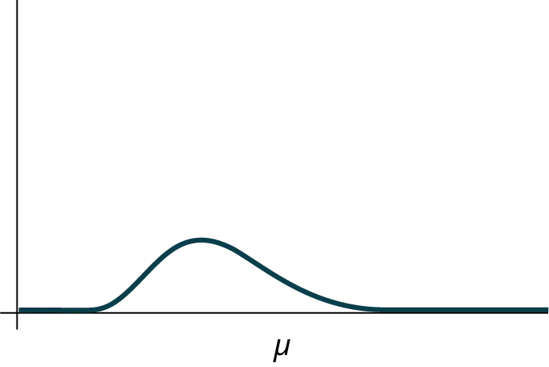

## 11.1
 
Các sự thật về phân phối khi bình phương

Ký hiệu cho phân phối khi bình phương là:

trong đó *df* = bậc tự do, phụ thuộc vào cách sử dụng phân phối khi bình phương. (Nếu bạn muốn thực hành tính toán các xác suất khi bình phương, hãy sử dụng *df* = *n* - 1. Bậc tự do cho ba cách sử dụng chính đều được tính toán khác nhau.)

Đối với phân phối *χ^2*, số trung bình quần thể là *μ* = *df* và độ lệch chuẩn quần thể là 

σ=

2(df)

σ=

2(df)

.

Biến ngẫu nhiên được hiển thị là *χ^2*, nhưng có thể là bất kỳ chữ cái viết hoa nào.

Biến ngẫu nhiên cho một phân phối khi bình phương với *k* bậc tự do là tổng của *k* biến chuẩn tắc bình phương độc lập.

*χ* = (_1^2*Z*) + ... + (_k^2

1. Đường cong không đối xứng và bị lệch phải.
1. There is a different chi-square curve for each *df*.

Hình 
11.2
1. Thống kê kiểm định cho bất kỳ kiểm định nào luôn lớn hơn hoặc bằng không.
1. Khi *df* > 90, đường cong khi bình phương xấp xỉ phân phối chuẩn. Đối với *X* ~ 

χ

1,000

2

χ

1,000

2

, số trung bình *μ* = *df* = 1.000 và độ lệch chuẩn *σ* = 

2(1,000)

2(1,000)

 = 44,7. Do đó, *X* ~ *N*(1.000, 44,7), xấp xỉ.
1. The mean, *μ*, is located just to the right of the peak.

Hình 
11.3
