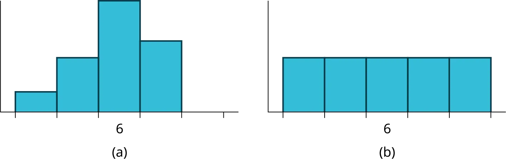

## Tổng hợp kiến thức: Bài tập về nhà

Một thị trấn nhỏ ở Hoa Kỳ có quần thể là 27,873 người. Độ tuổi của họ như sau:

| Nhóm tuổi | Phần trăm cộng đồng |
| --- | --- |
| 0–17 | 18,9 |
| 18–24 | 8,0 |
| 25–34 | 22,8 |
| 35–44 | 15,0 |
| 45–54 | 13,1 |
| 55–64 | 11,9 |
| 65+ | 10,3 |

1. Hãy xây dựng một biểu đồ histogram về phân phối độ tuổi cho thị trấn nhỏ này. Các cột sẽ **không** có cùng chiều rộng trong ví dụ này. Tại sao lại như vậy? Điều này có tác động gì đến độ tin cậy của biểu đồ?
1. Bao nhiêu phần trăm cộng đồng dưới 35 tuổi?
1. Biểu đồ hộp nào giống với thông tin trên nhất?
*Hình 
2.48*

Javier và Ercilia là những người giám sát tại một trung tâm mua sắm. Mỗi người được giao nhiệm vụ ước tính khoảng cách trung bình mà người mua sắm sống cách trung tâm mua sắm. Mỗi người đã khảo sát ngẫu nhiên 100 người mua sắm. Các mẫu đã mang lại thông tin sau.

|  | Javier | Ercilia |
| --- | --- | --- |
| ̅̅̅̅̅𝑥x¯x¯ | 6,0 dặm | 6,0 dặm |
| 𝑠ss | 4,0 dặm | 7,0 dặm |

1. Làm thế nào bạn có thể xác định cuộc khảo sát nào là chính xác?
1. Giải thích sự khác biệt trong kết quả của các cuộc khảo sát ngụ ý điều gì về dữ liệu.
1. If the two histograms depict the distribution of values for each supervisor, which one depicts Ercilia's sample?  How do you know?

Hình 
2.49
1. If the two box plots depict the distribution of values for each supervisor, which one depicts Ercilia’s sample?  How do you know?

![This shows two horizontal boxplots. The first boxplot is graphed over a number line from 0 to 21. The first whisker extends from 0 to 1. The box begins at the first quartile, 1, and ends at the third quartile, 14. A vertical, dashed line marks the median at 6. The second whisker extends from the third quartile to the largest value, 21. The second boxplot is graphed over a number line from 0 to 12.  The first whisker extends from 0 to 4. The box begins at the first quartile, 4, and ends at the third quartile, 9. A vertical, dashed line marks the median at 6. The second whisker extends from the third quartile to the largest value, 12.](../../../assets/img-2-3.webp)
Hình 
2,50
*Sử dụng thông tin sau để trả lời ba bài tập tiếp theo*: Chúng ta quan tâm đến số năm mà sinh viên trong một lớp thống kê sơ cấp cụ thể đã sống ở California. Thông tin trong bảng sau đây là từ toàn bộ lớp học.

| Số năm | Tần số | Số năm | Tần số |
| --- | --- | --- | --- |
| 7 | 1 | 22 | 1 |
| 14 | 3 | 23 | 1 |
| 15 | 1 | 26 | 1 |
| 18 | 1 | 40 | 2 |
| 19 | 4 | 42 | 2 |
| 20 | 3 |  |  |
|  |  |  | Tổng = 20 |

*IQR* là gì?

1. 8
1. 11
1. 15
1. 35
Yếu vị là gì?

1. 19
1. 19,5
1. 14 và 20
1. 22,65
Đây là một mẫu hay toàn bộ quần thể?

1. mẫu
1. toàn bộ quần thể
1. không cái nào cả
Hai mươi lăm sinh viên được chọn ngẫu nhiên đã được hỏi về số lượng phim họ đã xem trong tuần trước. Kết quả như sau:

| Số lượng phim | Tần số |
| --- | --- |
| 0 | 5 |
| 1 | 9 |
| 2 | 6 |
| 3 | 4 |
| 4 | 1 |

1. Tìm số trung bình mẫu ̅̅̅̅̅𝑥x¯x¯.
1. Tìm độ lệch chuẩn mẫu xấp xỉ, *s*.
Bốn mươi sinh viên được chọn ngẫu nhiên đã được hỏi về số đôi giày thể thao mà họ sở hữu. Gọi *X* = số đôi giày thể thao sở hữu. Kết quả như sau:

| *X* | Tần số |
| --- | --- |
| 1 | 2 |
| 2 | 5 |
| 3 | 8 |
| 4 | 12 |
| 5 | 12 |
| 6 | 0 |
| 7 | 1 |

1. Tìm số trung bình mẫu –𝑥x–x–
1. Tìm độ lệch chuẩn của mẫu, *s*
1. Vẽ biểu đồ histogram của dữ liệu.
1. Hoàn thành các cột của biểu đồ.
1. Tìm tứ phân vị thứ nhất.
1. Tìm trung vị.
1. Tìm tứ phân vị thứ ba.
1. Vẽ biểu đồ hộp của dữ liệu.
1. Bao nhiêu phần trăm sinh viên sở hữu ít nhất năm đôi?
1. Tìm bách phân vị thứ 40^th.
1. Tìm bách phân vị thứ 90^th.
1. Vẽ biểu đồ đường của dữ liệu
1. Vẽ biểu đồ thân lá của dữ liệu
Sau đây là cân nặng được công bố (tính bằng pound) của tất cả các thành viên trong đội San Francisco 49ers từ một năm trước.

177;  205;  210;  210;  232;  205;  185;  185;  178;  210;  206;  212;  184;  174;  185;  242;  188;  212;  215;  247;  241;  223;  220;  260;  245;  259;  278;  270;  280;  295;  275;  285;  290;  272;  273;  280;  285;  286;  200;  215;  185;  230;  250;  241;  190;  260;  250;  302;  265;  290;  276;  228;  265

1. Sắp xếp dữ liệu từ giá trị nhỏ nhất đến lớn nhất.
1. Tìm trung vị.
1. Tìm tứ phân vị thứ nhất.
1. Tìm tứ phân vị thứ ba.
1. Xây dựng một biểu đồ hộp của dữ liệu.
1. 50% trọng lượng ở giữa nằm trong khoảng từ _______ đến _______.
1. Nếu quần thể của chúng ta là tất cả các cầu thủ bóng bầu dục chuyên nghiệp, thì dữ liệu trên có phải là một mẫu trọng lượng hay là quần thể trọng lượng? Tại sao?
1. Assume the population was the San Francisco 49ers.  Find:
số trung bình quần thể, *μ*.
độ lệch chuẩn quần thể, *σ*.
trọng lượng thấp hơn số trung bình hai độ lệch chuẩn.
Khi Steve Young, một cầu thủ tiền vệ, chơi bóng bầu dục, anh ấy nặng 205 pound. Anh ấy cao hơn hay thấp hơn số trung bình bao nhiêu độ lệch chuẩn?
1. Cùng năm đó, trọng lượng trung bình của đội Dallas Cowboys là 240,08 pound với độ lệch chuẩn là 44,38 pound. Emmit Smith nặng 209 pound. So với đội của mình, ai nhẹ hơn, Smith hay Young? Bạn đã xác định câu trả lời của mình như thế nào?
Một trăm giáo viên đã tham dự một hội thảo về giải quyết vấn đề toán học. Thái độ của một mẫu đại diện gồm 12 giáo viên đã được đo lường trước và sau hội thảo. Một con số dương cho sự thay đổi thái độ cho thấy thái độ của giáo viên đối với toán học trở nên tích cực hơn. 12 điểm thay đổi như sau:

3; 
 8; 
–1; 
2; 
 0; 
5; 
–3; 
1; 
–1; 
6; 
 5; 
–2

1. Điểm thay đổi trung bình là bao nhiêu?
1. Độ lệch chuẩn cho quần thể này là bao nhiêu?
1. Điểm thay đổi trung vị là bao nhiêu?
1. Tìm điểm thay đổi thấp hơn số trung bình 2,2 độ lệch chuẩn.
Tham khảo [Hình 2.51](2-bringing-it-together-homework#fs-idm70725344) để xác định xem những điều nào sau đây là đúng và điều nào là sai. Giải thích lời giải của bạn cho từng phần bằng các câu hoàn chỉnh.

*Hình 
2,51*

1. Trung vị của cả ba biểu đồ đều giống nhau.
1. Chúng ta không thể xác định liệu bất kỳ số trung bình nào trong ba biểu đồ có khác nhau hay không.
1. Độ lệch chuẩn cho biểu đồ b lớn hơn độ lệch chuẩn cho biểu đồ a.
1. Chúng ta không thể xác định liệu bất kỳ tứ phân vị thứ ba nào trong ba biểu đồ có khác nhau hay không.
Trong một số gần đây của IEEE Spectrum, 84 hội nghị kỹ thuật đã được công bố. Bốn hội nghị kéo dài hai ngày. Ba mươi sáu hội nghị kéo dài ba ngày. Mười tám hội nghị kéo dài bốn ngày. Mười chín hội nghị kéo dài năm ngày. Bốn hội nghị kéo dài sáu ngày. Một hội nghị kéo dài bảy ngày. Một hội nghị kéo dài tám ngày. Một hội nghị kéo dài chín ngày. Gọi *X* = độ dài (tính bằng ngày) của một hội nghị kỹ thuật.

1. Sắp xếp dữ liệu vào một biểu đồ.
1. Tìm trung vị, tứ phân vị thứ nhất và tứ phân vị thứ ba.
1. Tìm bách phân vị thứ 65^th.
1. Tìm bách phân vị thứ 10^th.
1. Vẽ biểu đồ hộp của dữ liệu.
1. 50% ở giữa của các hội nghị kéo dài từ _______ ngày đến _______ ngày.
1. Tính số trung bình mẫu của số ngày diễn ra các hội nghị kỹ thuật.
1. Tính độ lệch chuẩn mẫu của số ngày diễn ra các hội nghị kỹ thuật.
1. Tìm yếu vị.
1. Nếu bạn đang lên kế hoạch cho một hội nghị kỹ thuật, bạn sẽ chọn độ dài nào cho hội nghị: số trung bình; trung vị; hay yếu vị? Giải thích lý do tại sao bạn đưa ra lựa chọn đó.
1. Đưa ra hai lý do tại sao bạn nghĩ rằng ba đến năm ngày dường như là độ dài phổ biến của các hội nghị kỹ thuật.
Một cuộc khảo sát về số lượng tuyển sinh tại 35 trường cao đẳng cộng đồng trên khắp Hoa Kỳ đã mang lại các số liệu sau:

6414;  1550; 2109; 9350; 21828; 4300;  5944; 5722; 2825; 2044; 5481;  5200; 5853; 2750; 10012; 6357;  27000; 9414; 7681; 3200; 17500;  9200; 7380; 18314; 6557; 13713;  17768; 7493; 2771; 2861; 1263;  7285; 28165; 5080; 11622

1. Sắp xếp dữ liệu vào một biểu đồ với sáu khoảng có độ rộng bằng nhau từ 0 đến 30.000. Đặt tên cho hai cột là "Số lượng tuyển sinh" và "Tần số."
1. Vẽ biểu đồ histogram của dữ liệu.
1. Nếu bạn xây dựng một trường cao đẳng cộng đồng mới, thông tin nào sẽ có giá trị hơn: yếu vị hay số trung bình?
1. Tính số trung bình của mẫu.
1. Tính độ lệch chuẩn của mẫu.
1. Một trường học có số lượng tuyển sinh là 8000 sẽ cách số trung bình bao nhiêu độ lệch chuẩn?
*Sử dụng thông tin sau để trả lời hai bài tập tiếp theo.* *X* = số ngày mỗi tuần mà 100 khách hàng sử dụng một cơ sở tập thể dục cụ thể.

| *x* | Tần số |
| --- | --- |
| 0 | 3 |
| 1 | 12 |
| 2 | 33 |
| 3 | 28 |
| 4 | 11 |
| 5 | 9 |
| 6 | 4 |

Bách phân vị thứ 80 là _____

1. 5
1. 80
1. 3
1. 4
Con số thấp hơn số trung bình 1,5 độ lệch chuẩn là khoảng _____

1. 0,7
1. 4,8
1. –2.8
1. Không thể xác định
Giả sử một nhà xuất bản đã thực hiện một cuộc khảo sát hỏi người tiêu dùng trưởng thành về số lượng sách bìa mềm hư cấu mà họ đã mua trong tháng trước. Kết quả được tóm tắt trong [Bảng 2.84](2-bringing-it-together-homework#table23).

| Số lượng sách | Tần số | Tần suất tương đối |
| --- | --- | --- |
| 0 | 18 |  |
| 1 | 24 |  |
| 2 | 24 |  |
| 3 | 22 |  |
| 4 | 15 |  |
| 5 | 10 |  |
| 7 | 5 |  |
| 9 | 1 |  |

1. Có giá trị ngoại lệ nào trong dữ liệu không? Sử dụng một kiểm định số học phù hợp liên quan đến *IQR* để xác định các giá trị ngoại lệ (nếu có) và nêu rõ kết luận của bạn.
1. Nếu một giá trị dữ liệu được xác định là giá trị ngoại lệ, chúng ta nên xử lý nó như thế nào?
1. Có giá trị dữ liệu nào cách số trung bình xa hơn hai độ lệch chuẩn không? Trong một số tình huống, các nhà thống kê có thể sử dụng tiêu chí này để xác định các giá trị dữ liệu bất thường so với các giá trị dữ liệu còn lại. (Lưu ý rằng tiêu chí này phù hợp nhất để sử dụng cho dữ liệu có hình dạng gò đống và đối xứng, thay vì dữ liệu bị lệch.)
1. Các phần a và c của bài toán này có cho cùng một câu trả lời không?
1. Kiểm tra hình dạng của dữ liệu. Phần nào, a hay c, của câu hỏi này đưa ra kết quả phù hợp hơn cho dữ liệu này?
1. Dựa trên hình dạng của dữ liệu, đâu là thước đo trung tâm phù hợp nhất cho dữ liệu này: số trung bình, trung vị hay yếu vị?
