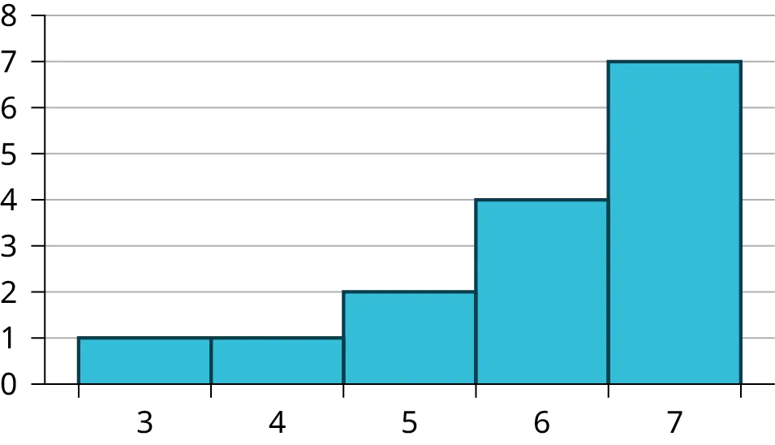
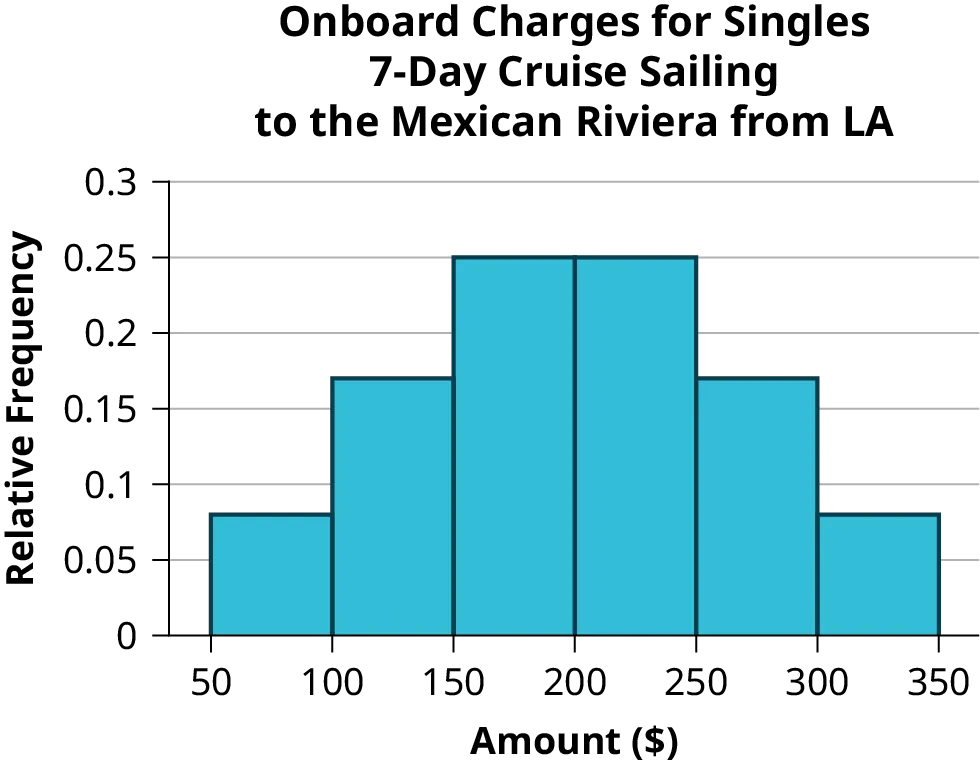
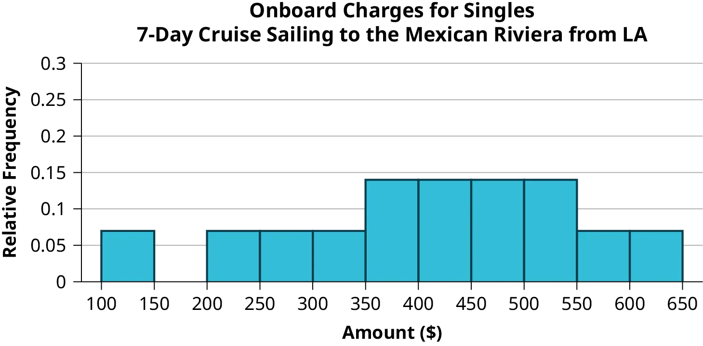
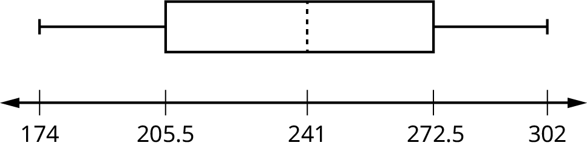

## Các lời giải

| Thân | Lá |
| --- | --- |
| 1 | 9 9 9 |
| 2 | 0 1 1 5 5 5 6 6 8 9 |
| 3 | 1 1 2 2 3 4 5 6 7 7 8 8 8 8 |
| 4 | 1 3  3 |

| Thân | Lá |
| --- | --- |
| 2 | 5 5 6 7 7 8 |
| 3 | 0 0 1 2 3 3 5 5 5 7 7 9 |
| 4 | 1 6 9 |
| 5 | 6 7 7 |
| 6 | 1 |

*Hình 
2,52*

*Hình 
2,53*

*Hình 
2,54*

*Hình 
2,55*

65

Tần suất tương đối cho biết *tỷ lệ* các điểm dữ liệu có từng giá trị. Tần số cho biết *số lượng* các điểm dữ liệu có từng giá trị.

Các câu trả lời sẽ khác nhau. Một biểu đồ histogram khả thi được hiển thị:

*Hình 
2,56*

Tìm trung điểm cho mỗi khoảng. Các giá trị này sẽ được vẽ trên trục *x*. Các giá trị tần số sẽ được vẽ trên các giá trị trục *y*.

*Hình 
2,57*

*Hình 
2,58*

1. Bách phân vị thứ 40^th là 37 năm.
1. Bách phân vị thứ 78^th là 70 năm.
Jesse tốt nghiệp thứ 37 trong một lớp gồm 180 học sinh. Có 180 – 37 = 143 học sinh xếp hạng dưới Jesse. Có một hạng là 37.

*x* = 143 và *y* = 1. 𝑥+0.5⁢𝑦𝑛x+0.5⁢ynx+0.5yn(100) = 143+0.5⁢(1)180143+0.5⁢(1)180143+0.5(1)180(100) = 79,72. Hạng 37 của Jesse đưa anh ấy vào bách phân vị thứ 80^th.

1. Đối với các vận động viên chạy trong một cuộc đua, việc có bách phân vị cao về tốc độ là điều đáng mong đợi hơn. Bách phân vị cao có nghĩa là tốc độ cao hơn, tức là nhanh hơn.
1. 40% vận động viên chạy với tốc độ từ 7,5 dặm một giờ trở xuống (chậm hơn). 60% vận động viên chạy với tốc độ từ 7,5 dặm một giờ trở lên (nhanh hơn).
Khi chờ đợi trong hàng tại DMV, bách phân vị thứ 85^th sẽ là một thời gian chờ đợi lâu so với những người khác đang chờ. 85% số người có thời gian chờ đợi ngắn hơn Mina. Trong bối cảnh này, Mina sẽ thích thời gian chờ đợi tương ứng với bách phân vị thấp hơn. 85% số người tại DMV đã chờ 32 phút hoặc ít hơn. 15% số người tại DMV đã chờ 32 phút hoặc lâu hơn.

Nhà sản xuất và người tiêu dùng sẽ rất khó chịu. Đây là chi phí sửa chữa lớn cho các hư hỏng so với các xe khác trong mẫu. DIỄN GIẢI: 90% số xe được thử nghiệm va chạm có chi phí sửa chữa hư hỏng là 1700 đô la hoặc ít hơn; chỉ 10% có chi phí sửa chữa hư hỏng là 1700 đô la hoặc nhiều hơn.

Bạn có thể chi trả cho 34% số ngôi nhà. 66% số ngôi nhà là quá đắt so với ngân sách của bạn. DIỄN GIẢI: 34% số ngôi nhà có giá 240.000 đô la hoặc ít hơn. 66% số ngôi nhà có giá 240.000 đô la hoặc nhiều hơn.

4

6 – 4 = 2

6

Hơn 25% nhân viên bán hàng bán được bốn chiếc xe trong một tuần điển hình. Bạn có thể thấy sự tập trung này trong biểu đồ hộp vì tứ phân vị thứ nhất bằng với trung vị. 25% cao nhất và 25% thấp nhất được phân bổ đều; các râu có cùng độ dài.

Số trung bình: 16 + 17 + 19 + 20 + 20 + 21 + 23 + 24 + 25 + 25 + 25 + 26 + 26 + 27 + 27 + 27 + 28 + 29 + 30 + 32 + 33 + 33 + 34 + 35 + 37 + 39 + 40 = 738;

738277382773827 = 27,33

Các độ dài thường gặp nhất là 25 và 27, xuất hiện ba lần. Yếu vị = 25, 27

4

Dữ liệu đối xứng. Trung vị là 3 và số trung bình là 2,85. Chúng gần nhau, và yếu vị nằm gần giữa dữ liệu, vì vậy dữ liệu đối xứng.

Dữ liệu bị lệch phải. Trung vị là 87,5 và số trung bình là 88,2. Mặc dù chúng gần nhau, yếu vị nằm bên trái của giữa dữ liệu, và có nhiều trường hợp 87 hơn bất kỳ số nào khác, vì vậy dữ liệu bị lệch phải.

Khi dữ liệu đối xứng, số trung bình và trung vị gần nhau hoặc bằng nhau.

Phân phối bị lệch phải vì nó trông như bị kéo dài sang bên phải.

Số trung bình là 4,1 và lớn hơn một chút so với trung vị, là bốn.

Yếu vị và trung vị là như nhau. Trong trường hợp này, cả hai đều là năm.

Phân phối bị lệch trái vì nó trông như bị kéo dài sang bên trái.

Số trung bình và trung vị đều là sáu.

Yếu vị là 12, trung vị là 12,5 và số trung bình là 15,1. Số trung bình là giá trị lớn nhất.

Số trung bình có xu hướng phản ánh sự lệch nhiều nhất vì nó bị ảnh hưởng nhiều nhất bởi các giá trị ngoại lệ.

*s* = 34,5

Đối với Fredo: *z* = 0.158 – 0.1660.0120.158 – 0.1660.0120.158 – 0.1660.012
 = –0,67

Đối với Karl: *z* = 0.177 – 0.1890.0150.177 – 0.1890.0150.177 – 0.1890.015
 = –0,8

Điểm *z* của Fredo là –0,67, cao hơn điểm *z* của Karl là –0,8. Đối với trung bình đánh bóng, giá trị cao hơn là tốt hơn, vì vậy Fredo có trung bình đánh bóng tốt hơn so với đội của mình.

1. 𝑠𝑥=√∑𝑓⁡𝑚2𝑛−̅̅̅̅̅𝑥2=√193157.4530−79.52=10.88sx=∑f⁡m2n−x¯2=193157.4530−79.52=10.88sx=∑fm2n−x¯2=193157.4530−79.52=10.88
1. 𝑠𝑥=√∑𝑓⁡𝑚2𝑛−̅̅̅̅̅𝑥2=√380945.3101−60.942=7.62sx=∑f⁡m2n−x¯2=380945.3101−60.942=7.62sx=∑fm2n−x¯2=380945.3101−60.942=7.62
1. 𝑠𝑥=√∑𝑓⁡𝑚2𝑛−̅̅̅̅̅𝑥2=√440051.586−70.662=11.14sx=∑f⁡m2n−x¯2=440051.586−70.662=11.14sx=∑fm2n−x¯2=440051.586−70.662=11.14
1. Example solution for using the random number generator for the TI-84+ to generate a simple random sample of 8 states. Instructions are as follows.

Đánh số các mục trong bảng từ 1–51 (Bao gồm Washington, DC; Đánh số theo chiều dọc)
Nhấn MATH
Di chuyển mũi tên sang PRB
Nhấn 5:randInt(
Nhập 51,1,8)

Tám con số được tạo ra (sử dụng phím mũi tên phải để cuộn qua các số). Các số này tương ứng với các bang được đánh số (cho ví dụ này: {47 21 9 23 51 13 25 4}). Nếu bất kỳ số nào bị lặp lại, hãy tạo một số khác bằng cách sử dụng 5:randInt(51,1). Ở đây, các bang (và Washington DC) là {Arkansas, Washington DC, Idaho, Maryland, Michigan, Mississippi, Virginia, Wyoming}.
Các tỷ lệ phần trăm tương ứng là {30,1, 22,2, 26,5, 27,1, 30,9, 34,0, 26,0, 25,1}.

Hình 
2,59
1. 

Hình 
2,60
1. 

Hình 
2,61
| Số tiền ($) | Tần số | Tần suất tương đối |
| --- | --- | --- |
| 51–100 | 5 | 0,08 |
| 101–150 | 10 | 0,17 |
| 151–200 | 15 | 0,25 |
| 201–250 | 15 | 0,25 |
| 251–300 | 10 | 0,17 |
| 301–350 | 5 | 0,08 |

| Số tiền ($) | Tần số | Tần suất tương đối |
| --- | --- | --- |
| 100–150 | 5 | 0,07 |
| 201–250 | 5 | 0,07 |
| 251–300 | 5 | 0,07 |
| 301–350 | 5 | 0,07 |
| 351–400 | 10 | 0,14 |
| 401–450 | 10 | 0,14 |
| 451–500 | 10 | 0,14 |
| 501–550 | 10 | 0,14 |
| 551–600 | 5 | 0,07 |
| 601–650 | 5 | 0,07 |

1. Xem [Bảng 2.87](2-solutions#Singles) và [Bảng 2.88](2-solutions#Couples).
1. In the following histogram data values that fall on the right boundary are counted in the class interval, while values that fall on the left boundary are not counted (with the exception of the first interval where both boundary values are included).

Hình 
2,62
1. In the following histogram, the data values that fall on the right boundary are counted in the class interval, while values that fall on the left boundary are not counted (with the exception of the first interval where values on both boundaries are included).

Hình 
2,63
1. Compare the two graphs:
    Answers may vary. Possible answers include:
      
Cả hai biểu đồ đều có một đỉnh duy nhất.
Cả hai biểu đồ đều sử dụng các khoảng với độ rộng bằng $50.

Answers may vary. Possible answers include:
      
Biểu đồ các cặp đôi có một khoảng không chứa giá trị nào.
Cần gần gấp đôi số khoảng để hiển thị dữ liệu cho các cặp đôi.

Câu trả lời có thể khác nhau. Các câu trả lời khả thi bao gồm: Các biểu đồ giống nhau nhiều hơn là khác biệt vì các mô hình tổng thể của các biểu đồ là như nhau.
1. Câu trả lời có thể khác nhau.
1. Compare the graph for the Singles with the new graph for the Couples:
  
Cả hai biểu đồ đều có một đỉnh duy nhất.
Cả hai biểu đồ đều hiển thị 6 khoảng.
Cả hai biểu đồ đều cho thấy cùng một mô hình chung.

Câu trả lời có thể khác nhau. Các câu trả lời khả thi bao gồm: Mặc dù độ rộng của các khoảng đối với các cặp đôi gấp đôi độ rộng của các khoảng đối với người độc thân, các biểu đồ này giống nhau nhiều hơn là khác biệt.
1. Câu trả lời có thể khác nhau. Các câu trả lời khả thi bao gồm: Bạn có thể so sánh các biểu đồ theo từng khoảng. Việc so sánh các mô hình tổng thể với thang đo mới trên biểu đồ Cặp đôi sẽ dễ dàng hơn. Vì một cặp đôi đại diện cho hai cá nhân, thang đo mới dẫn đến sự so sánh chính xác hơn.
1. Câu trả lời có thể khác nhau. Các câu trả lời khả thi bao gồm: Dựa trên các biểu đồ histogram, có vẻ như mức chi tiêu không thay đổi nhiều từ người độc thân sang các cá nhân là một phần của cặp đôi. Các mô hình tổng thể là như nhau. Phạm vi chi tiêu cho các cặp đôi xấp xỉ gấp đôi phạm vi chi tiêu cho các cá nhân.
c

Các câu trả lời sẽ khác nhau.

1. 1 – (0,02+0,09+0,19+0,26+0,18+0,17+0,02+0,01) = 0,06
1. 0,19+0,26+0,18 = 0,63
1. Câu trả lời có thể khác nhau.
1. Bách phân vị thứ 40^th sẽ nằm trong khoảng từ 30.000 đến 40.000
Bách phân vị thứ 80^th sẽ nằm trong khoảng từ 50.000 đến 75.000
1. Câu trả lời có thể khác nhau.
1. nhiều trẻ em hơn; râu bên trái cho thấy 25% quần thể là trẻ em từ 17 tuổi trở xuống. Râu bên phải cho thấy 25% quần thể là người lớn từ 50 tuổi trở lên, vì vậy người lớn từ 65 tuổi trở lên chiếm ít hơn 25%.
1. 62,4%
1. Câu trả lời sẽ khác nhau. Câu trả lời khả thi: Đại học Bang đã thực hiện một cuộc khảo sát để xem sinh viên của trường tham gia các hoạt động phục vụ cộng đồng như thế nào. Biểu đồ hộp cho thấy số giờ phục vụ cộng đồng mà những người tham gia đã ghi nhận trong năm qua.
1. Vì tứ phân vị thứ nhất và thứ hai gần nhau, dữ liệu trong quý này rất giống nhau. Không có nhiều sự biến thiên trong các giá trị. Dữ liệu trong quý thứ ba biến thiên nhiều hơn, hay phân tán hơn. Điều này rõ ràng vì tứ phân vị thứ hai cách xa tứ phân vị thứ ba.
1. Mỗi biểu đồ hộp phân tán nhiều hơn ở các giá trị lớn hơn. Mỗi biểu đồ đều bị lệch sang phải, vì vậy độ tuổi của 50% người mua hàng cao nhất biến thiên nhiều hơn độ tuổi của 50% người mua hàng thấp hơn.
1. Dòng xe BMW 3 có khả năng cao nhất là có giá trị ngoại lệ. Nó có râu dài nhất.
1. Khi so sánh độ tuổi trung vị, những người trẻ tuổi có xu hướng mua dòng xe BMW 3, trong khi những người lớn tuổi hơn có xu hướng mua dòng xe BMW 7. Tuy nhiên, đây không phải là quy tắc, vì có quá nhiều sự biến thiên trong mỗi tập dữ liệu.
1. Quý thứ hai có độ phân tán nhỏ nhất. Có vẻ như chỉ có sự khác biệt ba năm giữa tứ phân vị thứ nhất và trung vị.
1. Quý thứ ba có độ phân tán lớn nhất. Có vẻ như có sự khác biệt khoảng 14 năm giữa trung vị và tứ phân vị thứ ba.
1. *IQR* ~ 17 năm
1. Không có đủ thông tin để xác định. Mỗi khoảng nằm trong một phần tư, vì vậy chúng ta không thể biết chính xác dữ liệu trong phần tư đó tập trung ở đâu.
1. Khoảng từ 31 đến 35 tuổi có ít giá trị dữ liệu nhất. Hai mươi lăm phần trăm các giá trị nằm trong khoảng từ 38 đến 41, và 25% nằm trong khoảng từ 41 đến 64. Vì 25% các giá trị nằm trong khoảng từ 31 đến 38, chúng ta biết rằng ít hơn 25% nằm trong khoảng từ 31 đến 35.
Tỷ lệ trung bình, ̅̅̅̅̅𝑥=1328.6550=26.57x¯=1328.6550=26.57x¯=1328.6550=26.57

Trung vị là giá trị nằm ở giữa trong danh sách các giá trị dữ liệu đã được sắp xếp. Trung vị của một tập hợp gồm 11 giá trị sẽ là số thứ 6 theo thứ tự. Sáu năm sẽ có tổng bằng hoặc trên mức trung vị.

474 FTES

919

- số trung bình = 1,809,3
- trung vị = 1,812,5
- độ lệch chuẩn = 151,2
- tứ phân vị thứ nhất = 1,690
- tứ phân vị thứ ba = 1,935
- *IQR* = 245
Gợi ý: Hãy suy nghĩ về số năm được bao gồm trong mỗi khoảng thời gian và điều gì đã xảy ra với giáo dục đại học trong những khoảng thời gian đó.

Đối với đàn piano, chi phí của đàn piano thấp hơn 0,4 độ lệch chuẩn so với số trung bình. Đối với đàn guitar, chi phí của đàn guitar cao hơn 0,25 độ lệch chuẩn so với số trung bình. Đối với trống, chi phí của bộ trống thấp hơn 1,0 độ lệch chuẩn so với số trung bình. Trong ba loại, trống có chi phí thấp nhất khi so sánh với chi phí của các nhạc cụ khác cùng loại. Đàn guitar có chi phí cao nhất khi so sánh với chi phí của các nhạc cụ khác cùng loại.

- ̅̅̅̅̅𝑥=23.32x¯=23.32x¯=23.32
- Sử dụng TI 83/84, chúng ta thu được độ lệch chuẩn là: 𝑠𝑥=12.95.sx=12.95.sx=12.95.
- Tỷ lệ nghèo đói của Hoa Kỳ cao hơn 10,58% so với tỷ lệ trung bình.
- Vì độ lệch chuẩn là 12,95, chúng ta thấy rằng 23,32 + 12,95 = 36,27 là tỷ lệ phần trăm nghèo đói cách số trung bình một độ lệch chuẩn. Tỷ lệ của Hoa Kỳ thấp hơn một chút so với một độ lệch chuẩn so với số trung bình. Do đó, chúng ta có thể giả định rằng Hoa Kỳ không có tỷ lệ người dân trải qua nghèo đói cao bất thường.
1. Đối với biểu đồ, câu trả lời có thể khác nhau.
1. 49,7% cộng đồng dưới 35 tuổi.
1. Dựa trên thông tin trong bảng, biểu đồ (a) đại diện sát nhất cho dữ liệu.
a

b

1. 1,48
1. 1,12
1. 174; 177; 178; 184; 185; 185; 185; 185; 188; 190; 200; 205; 205; 206; 210; 210; 210; 212; 212; 215; 215; 220; 223; 228; 230; 232; 241; 241; 242; 245; 247; 250; 250; 259; 260; 260; 265; 265; 270; 272; 273; 275; 276; 278; 280; 280; 285; 285; 286; 290; 290; 295; 302
1. 241
1. 205,5
1. 272,5
1. 
1. 205,5, 272,5
1. mẫu
1. 236,34
37,50
161,34
0,84 độ lệch chuẩn dưới số trung bình
1. Trẻ
1. Đúng
1. Đúng
1. Đúng
1. Sai
1. Số lượng ghi danhTần số
1000-500010
5000-1000016
10000-150003
15000-200003
20000-250001
25000-300002

Bảng 
2,89
1. Các câu trả lời có thể khác nhau.
1. yếu vị
1. 8628,74
1. 6943,88
1. –0,09
a
