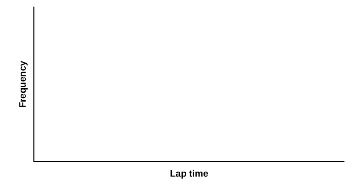

## 6.3
 
Phân phối chuẩn (Thời gian chạy một vòng)

#### Phân phối chuẩn (Thời gian chạy một vòng)

Giờ học:

Họ và tên:

- Sinh viên sẽ so sánh và đối chiếu dữ liệu thực nghiệm và phân phối lý thuyết để xác định xem thời gian chạy một vòng của Terry Vogel có khớp với một phân phối liên tục hay không.
Hướng dẫnLàm tròn các tần suất tương đối và xác suất đến bốn chữ số thập phân. Làm tròn tất cả các kết quả thập phân khác đến hai chữ số thập phân.

1. Use the data from [Appendix C](c-data-sets). Use a stratified sampling method by lap (races 1 to 20) and a random number generator to pick six lap times from each stratum. Record the lap times below for laps two to seven.

Bảng 
6.1
1. Construct a histogram. Make five to six intervals. Sketch the graph using a ruler and pencil. Scale the axes.

Hình 
6.10
1. Calculate the following:

x
¯

x
¯

*s* = _______
1. Vẽ một đường cong trơn đi qua đỉnh các cột của biểu đồ histogram. Viết một đến hai câu hoàn chỉnh để mô tả hình dạng chung của đường cong. (Hãy giữ nó đơn giản. Đồ thị đi thẳng qua, có hình chữ V, có bướu ở giữa hay ở một trong hai đầu, v.v.?)
Phân tích phân phối
Sử dụng số trung bình mẫu, độ lệch chuẩn mẫu và biểu đồ histogram của bạn để hỗ trợ, phân phối lý thuyết xấp xỉ của dữ liệu là gì?

- *X* ~ _____(_____,_____)
- Biểu đồ histogram giúp bạn đi đến phân phối xấp xỉ như thế nào?
Mô tả dữ liệu
Sử dụng dữ liệu bạn đã thu thập để hoàn thành các phát biểu sau.

- *IQR* đi từ __________ đến __________.
- *IQR**IQR**Q* – _1
- Bách phân vị thứ 15^th là _______.
- Bách phân vị thứ 85^th là _______.
- Trung vị là _______.
- Xác suất thực nghiệm để một thời gian chạy một vòng được chọn ngẫu nhiên lớn hơn 130 giây là _______.
- Giải thích ý nghĩa của bách phân vị thứ 85^th của dữ liệu này.
Phân phối lý thuyết
Sử dụng phân phối lý thuyết, hãy hoàn thành các phát biểu sau. Bạn nên sử dụng một xấp xỉ chuẩn dựa trên dữ liệu mẫu của mình.

- *IQR* đi từ __________ đến __________.
- *IQR* =  _______.
- Bách phân vị thứ 15^th là _______.
- Bách phân vị thứ 85^th là _______.
- Trung vị là _______.
- Xác suất để một thời gian chạy một vòng được chọn ngẫu nhiên lớn hơn 130 giây là _______.
- Giải thích ý nghĩa của bách phân vị thứ 85^th của phân phối này.
Câu hỏi thảo luậnDữ liệu từ phần có tiêu đề [Thu thập dữ liệu](6-3-normal-distribution-lap-times#CollectData) có đưa ra một xấp xỉ gần đúng với phân phối lý thuyết trong phần có tiêu đề [Phân tích phân phối](6-3-normal-distribution-lap-times#AnalyzeDist) không? Bằng các câu hoàn chỉnh và so sánh kết quả trong các phần có tiêu đề [Mô tả dữ liệu](6-3-normal-distribution-lap-times#DescData) và [Phân phối lý thuyết](6-3-normal-distribution-lap-times#TheoDist), hãy giải thích tại sao có hoặc tại sao không.
