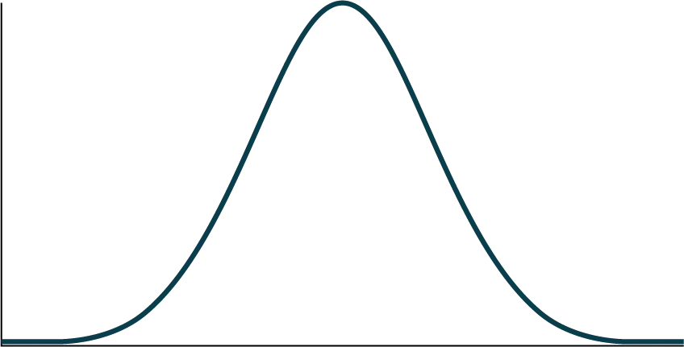

## Bài tập

Một chai nước chứa 12,05 ounce chất lỏng với độ lệch chuẩn là 0,01 ounce. Hãy định nghĩa biến ngẫu nhiên *X* bằng lời. *X* = ____________.

Một phân phối chuẩn có số trung bình là 61 và độ lệch chuẩn là 15. Trung vị là bao nhiêu?

*X**N*

*σ* = _______

Một công ty sản xuất bóng cao su. Đường kính trung bình của một quả bóng là 12 cm với độ lệch chuẩn là 0,2 cm. Hãy định nghĩa biến ngẫu nhiên *X* bằng lời. *X* = ______________.

*X**N*

Trung vị là bao nhiêu?

*X**N*

*σ* = _______

*X**N*

*μ* = _______

*z*-score đo lường điều gì?

Việc chuẩn hóa một phân phối chuẩn sẽ làm gì với số trung bình?

*X* ~ *N*(0, 1) có phải là một phân phối chuẩn tắc không? Tại sao có hoặc tại sao không?

*z*-score của *x* = 12 là bao nhiêu, nếu nó nằm cách số trung bình hai độ lệch chuẩn về phía bên phải?

*z*-score của *x* = 9 là bao nhiêu, nếu nó nằm cách số trung bình 1,5 độ lệch chuẩn về phía bên trái?

*z*-score của *x* = –2 là bao nhiêu, nếu nó nằm cách số trung bình 2,78 độ lệch chuẩn về phía bên phải?

*z*-score của *x* = 7 là bao nhiêu, nếu nó nằm cách số trung bình 0,133 độ lệch chuẩn về phía bên trái?

Giả sử *X* ~ *N*(2, 6). Giá trị *x* nào có *z*-score bằng ba?

Giả sử *X* ~ *N*(8, 1). Giá trị *x* nào có *z*-score bằng –2,25?

Giả sử *X* ~ *N*(9, 5). Giá trị *x* nào có *z*-score bằng –0,5?

Giả sử *X* ~ *N*(2, 3). Giá trị *x* nào có *z*-score bằng –0,67?

Giả sử *X* ~ *N*(4, 2). Giá trị *x* nào nằm cách số trung bình 1,5 độ lệch chuẩn về phía bên trái?

Giả sử *X* ~ *N*(4, 2). Giá trị *x* nào nằm cách số trung bình hai độ lệch chuẩn về phía bên phải?

Giả sử *X* ~ *N*(8, 9). Giá trị *x* nào nằm cách số trung bình 0,67 độ lệch chuẩn về phía bên trái?

Giả sử *X* ~ *N*(–1, 2). *z*-score của *x* = 2 là bao nhiêu?

Giả sử *X* ~ *N*(12, 6). *z*-score của *x* = 2 là bao nhiêu?

Giả sử *X* ~ *N*(9, 3). *z*-score của *x* = 9 là bao nhiêu?

Giả sử một phân phối chuẩn có số trung bình là sáu và độ lệch chuẩn là 1,5. *z*-score của *x* = 5,5 là bao nhiêu?

Trong một phân phối chuẩn, *x* = 5 và *z* = –1,25. Điều này cho bạn biết rằng *x* = 5 nằm cách số trung bình ____ độ lệch chuẩn về phía ____ (phải hoặc trái).

Trong một phân phối chuẩn, *x* = 3 và *z* = 0,67. Điều này cho bạn biết rằng *x* = 3 nằm cách số trung bình ____ độ lệch chuẩn về phía ____ (phải hoặc trái).

Trong một phân phối chuẩn, *x* = –2 và *z* = 6. Điều này cho bạn biết rằng *x* = –2 nằm cách số trung bình ____ độ lệch chuẩn về phía ____ (phải hoặc trái).

Trong một phân phối chuẩn, *x* = –5 và *z* = –3,14. Điều này cho bạn biết rằng *x* = –5 nằm cách số trung bình ____ độ lệch chuẩn về phía ____ (phải hoặc trái).

Trong một phân phối chuẩn, *x* = 6 và *z* = –1,7. Điều này cho bạn biết rằng *x* = 6 nằm cách số trung bình ____ độ lệch chuẩn về phía ____ (phải hoặc trái).

Khoảng bao nhiêu phần trăm các giá trị *x* từ một phân phối chuẩn nằm trong phạm vi một độ lệch chuẩn (trái và phải) so với số trung bình của phân phối đó?

Khoảng bao nhiêu phần trăm các giá trị *x* từ một phân phối chuẩn nằm trong phạm vi hai độ lệch chuẩn (trái và phải) so với số trung bình của phân phối đó?

Khoảng bao nhiêu phần trăm các giá trị *x* nằm giữa độ lệch chuẩn thứ hai và thứ ba (cả hai phía)?

Giả sử *X* ~ *N*(15, 3). 68,27% dữ liệu nằm giữa các giá trị *x* nào? Phạm vi các giá trị *x* được lấy trung tâm tại số trung bình của phân phối (tức là 15).

Giả sử *X* ~ *N*(–3, 1). 95,45% dữ liệu nằm giữa các giá trị *x* nào? Phạm vi các giá trị *x* được lấy trung tâm tại số trung bình của phân phối (tức là –3).

Giả sử *X* ~ *N*(–3, 1). 34,14% dữ liệu nằm giữa các giá trị *x* nào?

Khoảng bao nhiêu phần trăm các giá trị *x* nằm giữa số trung bình và ba độ lệch chuẩn?

Khoảng bao nhiêu phần trăm các giá trị *x* nằm giữa số trung bình và một độ lệch chuẩn?

Khoảng bao nhiêu phần trăm các giá trị *x* nằm giữa độ lệch chuẩn thứ nhất và thứ hai so với số trung bình (cả hai phía)?

Khoảng bao nhiêu phần trăm các giá trị *x* nằm giữa độ lệch chuẩn thứ nhất và thứ ba (cả hai phía)?

*Sử dụng thông tin sau để trả lời hai bài tập tiếp theo:* Tuổi thọ của các thiết bị thể dục đeo tay được phân phối chuẩn với số trung bình là 4,1 năm và độ lệch chuẩn là 1,3 năm. Một thiết bị thể dục đeo tay được bảo hành trong ba năm. Chúng ta quan tâm đến khoảng thời gian mà một thiết bị thể dục đeo tay hoạt động.

Hãy định nghĩa biến ngẫu nhiên *X* bằng lời. *X* = _______________.

*X* ~ _____(_____,_____)

Bạn sẽ biểu diễn diện tích bên trái của một trong một phát biểu xác suất như thế nào?

*Hình 
6.12*

Diện tích bên phải của một là bao nhiêu?

*Hình 
6.13*

*P*(*x* < 1) có bằng *P*(*x* ≤ 1) không? Tại sao?

Bạn sẽ biểu diễn diện tích bên trái của ba trong một phát biểu xác suất như thế nào?

*Hình 
6.14*

Diện tích bên phải của ba là bao nhiêu?

*Hình 
6.15*

Nếu diện tích bên trái của *x* trong một phân phối chuẩn là 0,123, thì diện tích bên phải của *x* là bao nhiêu?

Nếu diện tích bên phải của *x* trong một phân phối chuẩn là 0,543, thì diện tích bên trái của *x* là bao nhiêu?

*Sử dụng thông tin sau để trả lời bốn bài tập tiếp theo:*

*X**N*

Tìm xác suất để *x* > 56.

Tìm xác suất để *x* < 30.

Tìm bách phân vị thứ 80^th.

Tìm bách phân vị thứ 60^th.

*X**N*

Tìm xác suất để *x* nằm trong khoảng từ ba đến chín.

*X**N*

Tìm xác suất để *x* nằm trong khoảng từ một đến bốn.

*X**N*

Tìm giá trị lớn nhất của *x* trong tứ phân vị dưới.

*Sử dụng thông tin sau để trả lời ba bài tập tiếp theo:* Tuổi thọ của các thiết bị thể dục đeo tay được phân phối chuẩn với số trung bình là 4,1 năm và độ lệch chuẩn là 1,3 năm. Một thiết bị thể dục đeo tay được bảo hành trong ba năm. Chúng ta quan tâm đến khoảng thời gian một thiết bị thể dục đeo tay hoạt động. Tìm xác suất để một thiết bị thể dục đeo tay sẽ bị hỏng trong thời gian bảo hành.

1. Sketch the situation. Label and scale the axes. Shade the region corresponding to the probability.

Hình 
6.16
1. *P*(0 < *x* < ____________) = ___________ (Sử dụng số không cho giá trị tối thiểu của *x*.)
Tìm xác suất để một thiết bị thể dục đeo tay sẽ hoạt động trong khoảng từ 2,8 đến sáu năm.

1. Sketch the situation. Label and scale the axes. Shade the region corresponding to the probability.
Hình 
6.17
1. *P**x*
Tìm bách phân vị thứ 70^th của phân phối cho thời gian hoạt động của một thiết bị thể dục đeo tay.

1. Sketch the situation. Label and scale the axes. Shade the region corresponding to the lower 70%.
Hình 
6.18
1. *P*(*x* < *k*) = __________ Do đó, *k* = _________
