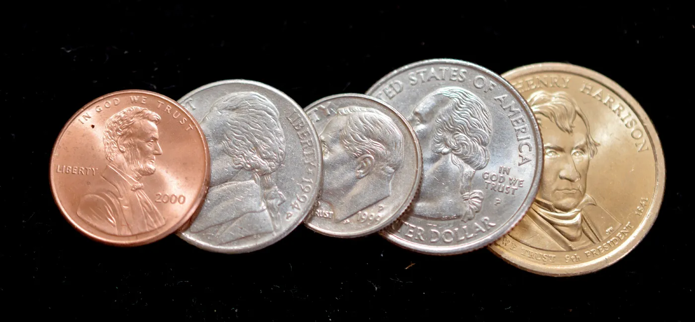
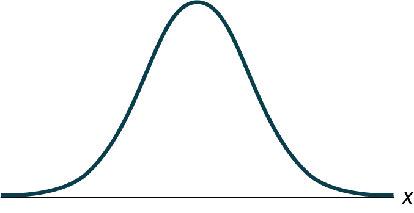

## Bài tập thực hành

*Sử dụng thông tin sau để trả lời sáu bài tập tiếp theo:* Yoonie là quản lý nhân sự tại một tập đoàn lớn. Mỗi tháng, cô phải đánh giá 16 nhân viên. Từ kinh nghiệm trước đây, cô nhận thấy mỗi bài đánh giá mất khoảng bốn giờ để hoàn thành với độ lệch chuẩn của quần thể là 1,2 giờ. Gọi *Χ* là biến ngẫu nhiên đại diện cho thời gian cô hoàn thành một bài đánh giá. Giả sử *Χ* được phân phối chuẩn. Gọi 

x
¯

x
¯
 là biến ngẫu nhiên đại diện cho thời gian trung bình để hoàn thành 16 bài đánh giá. Giả sử rằng 16 bài đánh giá này đại diện cho một tập hợp ngẫu nhiên các bài đánh giá.

Số trung bình, độ lệch chuẩn và kích thước mẫu là bao nhiêu?

Hoàn thành các phân phối.

1. *X* ~ _____(_____,_____)
1. X
¯

X
¯
Tìm xác suất để **một** bài đánh giá sẽ khiến Yoonie mất từ 3,5 đến 4,25 giờ. Vẽ đồ thị, dán nhãn và chia tỷ lệ trục hoành. Tô bóng vùng tương ứng với xác suất đó.

1. 
Hình 
7.16
1. *P*(________ < *x* < ________) = _______
Tìm xác suất để **số trung bình** các bài đánh giá trong một tháng sẽ khiến Yoonie mất từ 3,5 đến 4,25 giờ. Vẽ đồ thị, dán nhãn và chia tỷ lệ trục hoành. Tô bóng vùng tương ứng với xác suất đó.

1. 
Hình 
7.17
1. *P*(________________) = _______
Điều gì khiến các xác suất trong [Bài tập 7.3](7-practice#element-446) và [Bài tập 7.4](7-practice#element-322) khác nhau?

Tìm bách phân vị thứ 95 cho thời gian trung bình để hoàn thành các bài đánh giá trong một tháng. Vẽ đồ thị.

1. 
Hình 
7.18
1. Bách phân vị thứ 95^th =____________
*Sử dụng thông tin sau để trả lời bốn bài tập tiếp theo:* Một phân phối chưa biết có số trung bình là 80 và độ lệch chuẩn là 12. Một mẫu có kích thước 95 được lấy ngẫu nhiên từ quần thể.

Tìm xác suất để tổng của 95 giá trị lớn hơn 7,650.

Tìm xác suất để tổng của 95 giá trị nhỏ hơn 7,400.

Tìm tổng lớn hơn số trung bình của các tổng hai độ lệch chuẩn.

Tìm tổng nhỏ hơn số trung bình của các tổng 1,5 độ lệch chuẩn.

*Sử dụng thông tin sau để trả lời năm bài tập tiếp theo:* Phân phối kết quả từ một xét nghiệm cholesterol có số trung bình là 180 và độ lệch chuẩn là 20. Một mẫu có kích thước 40 được lấy ngẫu nhiên.

Tìm xác suất để tổng của 40 giá trị lớn hơn 7,500.

Tìm xác suất để tổng của 40 giá trị nhỏ hơn 7.000.

Tìm tổng lớn hơn số trung bình của các tổng một độ lệch chuẩn.

Tìm tổng nhỏ hơn số trung bình của các tổng 1,5 độ lệch chuẩn.

Tìm tỷ lệ phần trăm các tổng nằm giữa 1,5 độ lệch chuẩn dưới số trung bình của các tổng và một độ lệch chuẩn trên số trung bình của các tổng.

*Sử dụng thông tin sau để trả lời sáu bài tập tiếp theo:* Một nhà nghiên cứu đo lượng đường trong một vài lon soda cùng loại. Số trung bình là 39,01 với độ lệch chuẩn là 0,5. Nhà nghiên cứu chọn ngẫu nhiên một mẫu gồm 100 lon.

Tìm xác suất để tổng của 100 giá trị lớn hơn 3,910.

Tìm xác suất để tổng của 100 giá trị nhỏ hơn 3,900.

Tìm xác suất để tổng của 100 giá trị nằm giữa các số bạn đã tìm thấy trong [Bài tập 7.16](7-practice#exercise11) và [Bài tập 7.17](7-practice#exercise12).

Tìm tổng có điểm z là –2,5.

Tìm tổng có điểm z là 0,5.

Tìm xác suất để các tổng sẽ nằm giữa các điểm z là –2 và 1.

*Sử dụng thông tin sau để trả lời bốn bài tập tiếp theo:* Một phân phối chưa biết có số trung bình là 12 và độ lệch chuẩn là một. Một mẫu có kích thước 25 được lấy. Gọi *X* = đối tượng quan tâm.

Số trung bình của *ΣX* là bao nhiêu?

Độ lệch chuẩn của *ΣX* là bao nhiêu?

*P*(*Σx* = 290) là bao nhiêu?

*P*(*Σx* > 290) là bao nhiêu?

Đúng hay Sai: chỉ các tổng của các phân phối chuẩn mới cũng là các phân phối chuẩn.

Để các tổng của một phân phối tiến tới một phân phối chuẩn, điều gì phải đúng?

Bạn cần biết ba điều gì về một phân phối để tìm xác suất của các tổng?

Một phân phối chưa biết có số trung bình là 25 và độ lệch chuẩn là sáu. Gọi *X* = một đối tượng từ phân phối này. Kích thước mẫu là bao nhiêu nếu độ lệch chuẩn của *ΣX* là 42?

Một phân phối chưa biết có số trung bình là 19 và độ lệch chuẩn là 20. Gọi *X* = đối tượng quan tâm. Kích thước mẫu là bao nhiêu nếu số trung bình của *ΣX* là 15,200?

*
Sử dụng thông tin sau để trả lời ba bài tập tiếp theo.* Một nhà nghiên cứu thị trường phân tích số lượng thiết bị điện tử mà khách hàng mua trong một lần mua hàng. Phân phối có số trung bình là ba với độ lệch chuẩn là 0,7. Họ lấy mẫu 400 khách hàng.

Điểm z cho *Σx* = 840 là bao nhiêu?

Điểm z cho *Σx* = 1,186 là bao nhiêu?

*P*(*Σx* < 1,186) là bao nhiêu?

*
Sử dụng thông tin sau để trả lời ba bài tập tiếp theo:* Một phân phối chưa biết có số trung bình là 100, độ lệch chuẩn là 100 và kích thước mẫu là 100. Gọi *X* = một đối tượng quan tâm.

Số trung bình của *ΣX* là bao nhiêu?

Độ lệch chuẩn của *ΣX* là bao nhiêu?

*P*(*Σx* > 9.000) là bao nhiêu?

*Sử dụng thông tin sau để trả lời mười bài tập tiếp theo:* Một nhà sản xuất sản xuất các quả tạ nâng 25 pound. Trọng lượng thực tế thấp nhất là 24 pound và cao nhất là 26 pound. Mỗi trọng lượng đều có khả năng xảy ra như nhau nên phân phối trọng lượng là phân phối đều. Một mẫu gồm 100 quả tạ được lấy.

1. Phân phối cho trọng lượng của một quả tạ 25 pound là gì? Số trung bình và độ lệch chuẩn là bao nhiêu?
1. Phân phối cho trọng lượng trung bình của 100 quả tạ 25 pound là gì?
1. Tìm xác suất để trọng lượng thực tế trung bình của 100 quả tạ nhỏ hơn 24,9.
Vẽ đồ thị từ [Bài tập 7.37](7-practice#exercise4)

Tìm xác suất để trọng lượng thực tế trung bình của 100 quả tạ lớn hơn 25,2.

Vẽ biểu đồ từ [Bài tập 7.39](7-practice#exercise6)

Tìm bách phân vị thứ 90^th cho số trung bình của 100 trọng lượng.

Vẽ biểu đồ từ [Bài tập 7.41](7-practice#exercise8)

1. Phân phối cho tổng trọng lượng của 100 quả tạ 25 pound là gì?
1. Tìm *P*(*Σx* < 2,450).
Vẽ biểu đồ từ [Bài tập 7.43](7-practice#exercise10)

Tìm bách phân vị thứ 90^th cho tổng trọng lượng của 100 trọng lượng.

Vẽ biểu đồ từ [Bài tập 7.45](7-practice#exercise120)

*
Sử dụng thông tin sau để trả lời năm bài tập tiếp theo:* Khoảng thời gian sử dụng pin của một chiếc điện thoại thông minh cụ thể tuân theo phân phối mũ với số trung bình là mười tháng. Một mẫu gồm 64 chiếc điện thoại thông minh này được lấy.

1. Độ lệch chuẩn là bao nhiêu?
1. Tham số *m* là gì?
Phân phối cho khoảng thời gian sử dụng của một viên pin là gì?

Phân phối cho khoảng thời gian sử dụng trung bình của 64 viên pin là gì?

Phân phối cho tổng khoảng thời gian sử dụng của 64 viên pin là gì?

Tìm xác suất để số trung bình của mẫu nằm trong khoảng từ bảy đến 11.

Tìm bách phân vị thứ 80^th cho tổng khoảng thời gian sử dụng của 64 viên pin.

Tìm *IQR* cho khoảng thời gian sử dụng trung bình của 64 viên pin.

Tìm 80% ở giữa cho tổng khoảng thời gian sử dụng của 64 viên pin.

*
Sử dụng thông tin sau để trả lời tám bài tập tiếp theo:* Một phân phối đều có giá trị tối thiểu là sáu và giá trị tối đa là mười. Một mẫu gồm 50 phần tử được lấy.

Tìm *P*(*Σx* > 420).

Tìm bách phân vị thứ 90^th cho các tổng.

Tìm bách phân vị thứ 15^th cho các tổng.

Tìm tứ phân vị thứ nhất cho các tổng.

Tìm tứ phân vị thứ ba cho các tổng.

Tìm bách phân vị thứ 80^th cho các tổng.
