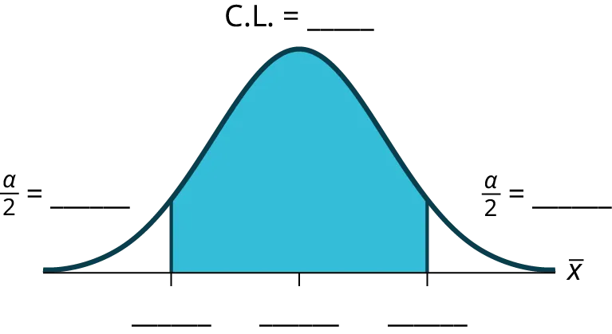

## 8.4
 
Confidence Interval (Home Costs)

## 8.4
 
Khoảng tin cậy (Chi phí nhà ở)

#### Confidence Interval (Home Costs)

#### Khoảng tin cậy (Chi phí nhà ở)

Class Time:

Thời gian học:

Names:

Họ và tên:

- The student will calculate the 90% confidence interval for the mean cost of a home in the area in which this school is located.
- Sinh viên sẽ tính toán khoảng tin cậy 90% cho chi phí trung bình của một ngôi nhà trong khu vực nơi trường học này tọa lạc.
- The student will interpret confidence intervals.
- Sinh viên sẽ giải thích các khoảng tin cậy.
- The student will determine the effects of changing conditions on the confidence interval.
- Sinh viên sẽ xác định ảnh hưởng của việc thay đổi các điều kiện đối với khoảng tin cậy.
Collect the Data
Check the Real Estate section in your local newspaper. Record the sale prices for 35 randomly selected homes recently listed in the county.

Thu thập dữ liệu
Kiểm tra mục Bất động sản trên tờ báo địa phương của bạn. Ghi lại giá bán của 35 ngôi nhà được chọn ngẫu nhiên mới được niêm yết trong quận.

Many newspapers list them only one day per week. Also, we will assume that homes come up for sale randomly.

Nhiều tờ báo chỉ liệt kê chúng mỗi tuần một lần. Ngoài ra, chúng ta sẽ giả định rằng các ngôi nhà được rao bán một cách ngẫu nhiên.

1. Complete the table:

Table 
8.5
 
 

Bảng 
8.5
1. Compute the following:

x
¯

x
¯
 = _____

x
¯

x
¯

s
x

s
x

 = _____

s
x

s
x

*n* = _____*n* = _____
1. In words, define the random variable 

X
¯

X
¯
.
1. Hãy định nghĩa biến ngẫu nhiên 

X
¯

X
¯
 bằng lời.
1. State the estimated distribution to use. Use both words and symbols.
1. Nêu phân phối ước tính cần sử dụng. Sử dụng cả từ ngữ và ký hiệu.
1. Calculate the confidence interval and the error bound.

Confidence Interval: _____Khoảng tin cậy: _____
Error Bound: _____Sai số biên: _____
1. How much area is in both tails (combined)? *α* = _____
1. Diện tích trong cả hai đuôi (kết hợp) là bao nhiêu? *α* = _____
1. How much area is in each tail? 

α
2

α
2

 = _____
1. Diện tích trong mỗi đuôi là bao nhiêu? 

α
2

α
2

 = _____
1. Fill in the blanks on the graph with the area in each section. Then, fill in the number
line with the upper and lower limits of the confidence interval and the sample mean.

Figure 
8.6
Hình 
8.6
1. Some students think that a 90% confidence interval contains 90% of the data. Use the list of data on the first page and count how many of the data values lie within the confidence interval. What percent is this? Is this percent close to 90%? Explain why this percent should or should not be close to 90%.
1. Một số sinh viên nghĩ rằng khoảng tin cậy 90% chứa 90% dữ liệu. Hãy sử dụng danh sách dữ liệu ở trang đầu tiên và đếm xem có bao nhiêu giá trị dữ liệu nằm trong khoảng tin cậy. Tỷ lệ phần trăm này là bao nhiêu? Tỷ lệ phần trăm này có gần với 90% không? Giải thích tại sao tỷ lệ phần trăm này nên hoặc không nên gần với 90%.
1. In two to three complete sentences, explain what a confidence interval means (in general), as if you were talking to someone who has not taken statistics.
1. Trong hai đến ba câu hoàn chỉnh, hãy giải thích ý nghĩa của khoảng tin cậy (nói chung), như thể bạn đang nói chuyện với một người chưa từng học thống kê.
1. In one to two complete sentences, explain what this confidence interval means for this particular study.
1. Trong một đến hai câu hoàn chỉnh, hãy giải thích ý nghĩa của khoảng tin cậy này đối với nghiên cứu cụ thể này.
1. Using the given information, construct a confidence interval for each confidence level given.

Confidence levelMức độ tin cậy
EBM/Error BoundEBM/Sai số biên
Confidence IntervalKhoảng tin cậy

50%50%

80%80%

95%95%

99%99%

Table 
8.6
 
 

Bảng 
8.6
1. What happens to the EBM as the confidence level increases? Does the width of the confidence interval increase or decrease? Explain why this happens.
1. Điều gì xảy ra với EBM khi mức độ tin cậy tăng lên? Độ rộng của khoảng tin cậy tăng hay giảm? Giải thích tại sao điều này xảy ra.
