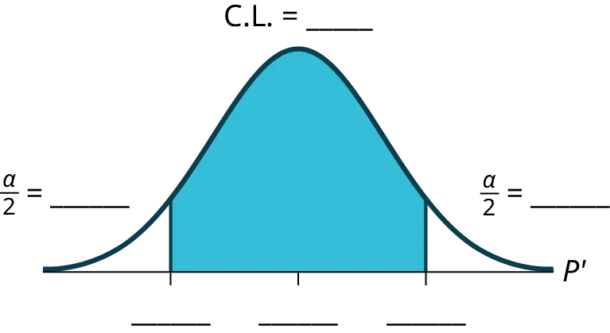

## 8.5
 
Confidence Interval (Place of Birth)

## 8.5
 
Khoảng tin cậy (Nơi sinh)

#### Confidence Interval (Place of Birth)

#### Khoảng tin cậy (Nơi sinh)

Class Time:

Thời gian học:

Names:

Họ và tên:

- The student will calculate the 90% confidence interval the proportion of students in this school who were born in this state.
- Sinh viên sẽ tính toán khoảng tin cậy 90% cho tỷ lệ sinh viên trong trường này được sinh ra tại tiểu bang này.
- The student will interpret confidence intervals.
- Sinh viên sẽ diễn giải các khoảng tin cậy.
- The student will determine the effects of changing conditions on the confidence interval.
- Sinh viên sẽ xác định ảnh hưởng của việc thay đổi các điều kiện lên khoảng tin cậy.
1. Survey the students in your class, asking them if they were born in this state. Let *X* = the number that were born in this state.

*n* = ____________*n* = ____________
*x* =  ____________*x* =  ____________
1. In words, define the random variable *P′*.
1. Hãy định nghĩa biến ngẫu nhiên *P′* bằng lời.
1. State the estimated distribution to use.
1. Nêu phân phối ước lượng cần sử dụng.
1. Calculate the confidence interval and the error bound.

Confidence Interval: _____Khoảng tin cậy: _____
Error Bound: _____Sai số biên: _____
1. How much area is in both tails (combined)? α = _____
1. Diện tích ở cả hai đuôi (kết hợp) là bao nhiêu? α = _____
1. How much area is in each tail? 

α
2

α
2

 = _____
1. Diện tích ở mỗi đuôi là bao nhiêu? 

α
2

α
2

 = _____
1. Fill in the blanks on the graph with the area in each section. Then, fill in the number line with the upper and lower limits of the confidence interval and the sample proportion.

Figure 
8.7
Hình 
8.7
1. In two to three complete sentences, explain what a confidence interval means (in general), as though you were talking to someone who has not taken statistics.
1. Trong hai đến ba câu hoàn chỉnh, hãy giải thích ý nghĩa của khoảng tin cậy (nói chung), như thể bạn đang nói chuyện với một người chưa từng học thống kê.
1. In one to two complete sentences, explain what this confidence interval means for this particular study.
1. Trong một đến hai câu hoàn chỉnh, hãy giải thích ý nghĩa của khoảng tin cậy này đối với nghiên cứu cụ thể này.
1. Construct a confidence interval for each confidence level given.

Confidence levelMức tin cậy
EBP/Error BoundEBP/Sai số biên
Confidence IntervalKhoảng tin cậy

50%50%

80%80%

95%95%

99%99%

Table 
8.7
 
 

Bảng 
8.7
1. What happens to the EBP as the confidence level increases? Does the width of the confidence interval increase or decrease? Explain why this happens.
1. Điều gì xảy ra với EBP khi mức tin cậy tăng lên? Độ rộng của khoảng tin cậy tăng hay giảm? Hãy giải thích tại sao điều này xảy ra.
