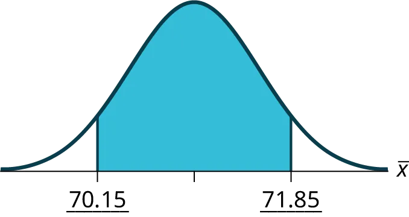
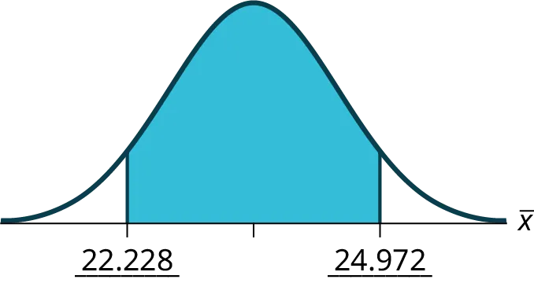
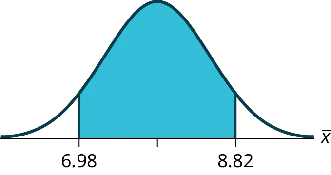
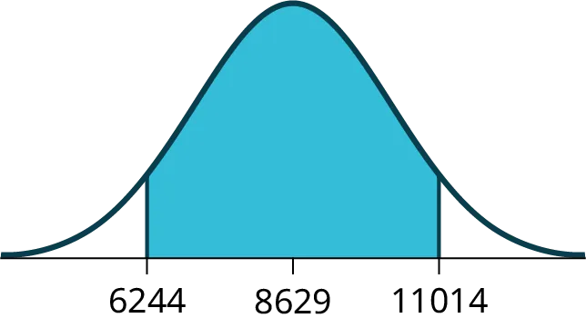
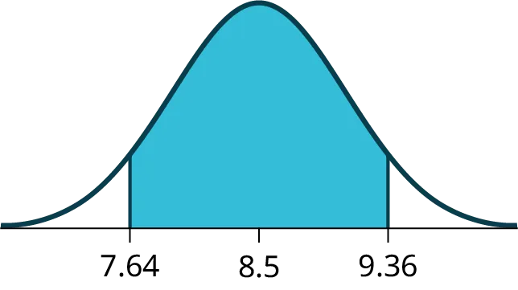

## Solutions

## Lời giải

1. 244
1. 244
1. 15
1. 15
1. 50
1. 50
N(

244,

15

50

)

N(

244,

15

50

)

N(

244,

15

50

)

N(

244,

15

50

)

As the sample size increases, there will be less variability in the mean, so the interval size decreases.

Khi kích thước mẫu tăng lên, sự biến thiên của số trung bình sẽ giảm, do đó kích thước khoảng giảm xuống.

*X* is the time in minutes it takes to complete the U.S. Census short form. 

X
¯

X
¯
 is the mean time it took a sample of 200 people to complete the U.S. Census short form.

*X* là thời gian tính bằng phút để hoàn thành mẫu điều tra dân số ngắn của Hoa Kỳ. 

X
¯

X
¯
 là thời gian trung bình mà một mẫu gồm 200 người đã mất để hoàn thành mẫu điều tra dân số ngắn của Hoa Kỳ.

CI: (7.9441, 8.4559)

CI: (7.9441, 8.4559)

*Figure 
8.11*

*Hình 
8.11*

*EBM* = 0.26

*EBM* = 0.26

The level of confidence would decrease because decreasing *n* makes the confidence interval wider, so at the same error bound, the confidence level decreases.

Mức độ tin cậy sẽ giảm vì việc giảm *n* làm cho khoảng tin cậy rộng hơn, vì vậy tại cùng một biên độ sai số, mức độ tin cậy sẽ giảm.

1. x
¯

x
¯
 = 2.2
1. x
¯

x
¯
1. *σ* = 0.2
1. *σ* = 0.2
1. *n* = 20
1. *n* = 20
X
¯

X
¯
 is the mean weight of a sample of 20 heads of lettuce.

X
¯

X
¯
 là trọng lượng trung bình của một mẫu gồm 20 cây xà lách.

*EBM* = 0.07
      
CI: (2.1264, 2.2736)

*EBM*

*Figure 
8.12*

*Hình 
8.12*

The interval is greater because the level of confidence increased. If the only change made in the analysis is a change in confidence level, then all we are doing is changing how much area is being calculated for the normal distribution. Therefore, a larger confidence level results in larger areas and larger intervals.

Khoảng tin cậy lớn hơn vì mức độ tin cậy đã tăng lên. Nếu thay đổi duy nhất được thực hiện trong phân tích là thay đổi mức độ tin cậy, thì tất cả những gì chúng ta đang làm là thay đổi diện tích được tính cho phân phối chuẩn. Do đó, mức độ tin cậy lớn hơn dẫn đến diện tích lớn hơn và các khoảng lớn hơn.

The confidence level would increase.

Mức độ tin cậy sẽ tăng lên.

30.4

30.4

*σ*

*σ*

*μ*

*μ*

normal

chuẩn

0.025

0.025

(24.52,36.28)

(24.52,36.28)

We are 95% confident that the true mean age for Winger Foothill College students is between 24.52 and 36.28.

Chúng ta tin cậy 95% rằng độ tuổi trung bình thực sự của sinh viên trường Winger Foothill nằm trong khoảng từ 24.52 đến 36.28.

The error bound for the mean would decrease because as the CL decreases, you need less area under the normal curve (which translates into a smaller interval) to capture the true population mean.

Biên độ sai số cho số trung bình sẽ giảm vì khi CL giảm, bạn cần ít diện tích hơn dưới đường cong chuẩn (điều này chuyển thành một khoảng nhỏ hơn) để bao hàm số trung bình quần thể thực sự.

*X* is the number of hours a patient waits in the emergency room before being called back to be examined. 

X
¯

X
¯
 is the mean wait time of 70 patients in the emergency room.

*X* là số giờ một bệnh nhân chờ đợi trong phòng cấp cứu trước khi được gọi tên để khám. 

X
¯

X
¯
 là thời gian chờ đợi trung bình của 70 bệnh nhân trong phòng cấp cứu.

CI: (1.3808, 1.6192)

CI: (1.3808, 1.6192)

*Figure 
8.13*

*Hình 
8.13*

*EBM* = 0.12

*EBM* = 0.12

1. x
¯

x
¯
 = 151
1. x
¯

x
¯
1. s
x

s
x

 = 32
1. s
x

s
x
1. *n* = 108
1. *n* = 108
1. *n* – 1 = 107
1. *n* – 1 = 107
X
¯

X
¯
 is the mean number of hours spent watching television per month from a sample of 108 Americans.

X
¯

X
¯
 là số giờ trung bình dành cho việc xem truyền hình mỗi tháng từ một mẫu gồm 108 người Mỹ.

CI: (142.92, 159.08)

CI: (142.92, 159.08)

*Figure 
8.14*

*Hình 
8.14*

*EBM* = 8.08

*EBM* = 8.08

1. 3.26
1. 3.26
1. 1.02
1. 1.02
1. 39
1. 39
*μ*

*μ*

*t*
_38

*t*
_38

0.025

0.025

(2.93, 3.59)

(2.93, 3.59)

We are 95% confident that the true mean number of colors for national flags is between 2.93 colors and 3.59 colors.

Chúng ta tin cậy 95% rằng số lượng màu trung bình thực sự của các lá cờ quốc gia nằm trong khoảng từ 2.93 màu đến 3.59 màu.

The error bound would become EBM = 0.245. This error bound decreases because as sample sizes increase, variability decreases and we need less interval length to capture the true mean.

Biên độ sai số sẽ trở thành EBM = 0.245. Biên độ sai số này giảm vì khi kích thước mẫu tăng, sự biến thiên giảm và chúng ta cần độ dài khoảng nhỏ hơn để bao hàm số trung bình thực sự.

The sample size needed would increase. As the confidence level increases, αα decreases and z(a2)z(a2) increases. To maintain the same error bound, the size of the sample needs to increase.

Kích thước mẫu cần thiết sẽ tăng lên. Khi mức độ tin cậy tăng, αα giảm và z(a2)z(a2) tăng. Để duy trì cùng một biên độ sai số, kích thước mẫu cần phải tăng lên.

*X* is the number of “successes” where the woman makes the majority of the purchasing decisions for the household. *P*′ is the percentage of households sampled where the woman makes the majority of the purchasing decisions for the household.

*X* là số "thành công" trong đó người phụ nữ đưa ra phần lớn các quyết định mua sắm cho hộ gia đình. *P*′ là tỷ lệ phần trăm các hộ gia đình được lấy mẫu mà người phụ nữ đưa ra phần lớn các quyết định mua sắm cho hộ gia đình.

CI: (0.5321, 0.6679)

CI: (0.5321, 0.6679)

*Figure 
8.15*

*Hình 
8.15*

*EBM*: 0.0679

*EBM*: 0.0679

*X* is the number of “successes” where an executive prefers a truck. *P*′ is the percentage of executives sampled who prefer a truck.

*X* là số "thành công" trong đó một giám đốc điều hành thích xe tải hơn. *P*′ là tỷ lệ phần trăm các giám đốc điều hành được lấy mẫu thích xe tải hơn.

CI: (0.19432, 0.33068)

CI: (0.19432, 0.33068)

*Figure 
8.16*

*Hình 
8.16*

*EBM*: 0.0707

*EBM*: 0.0707

The sampling error means that the true mean can be 2% above or below the sample mean.

Sai số chọn mẫu có nghĩa là số trung bình thực sự có thể cao hơn hoặc thấp hơn 2% so với số trung bình mẫu.

*P*′ is the proportion of voters sampled who said the economy is the most important issue in the upcoming election.

*P*′ là tỷ lệ cử tri được lấy mẫu cho biết nền kinh tế là vấn đề quan trọng nhất trong cuộc bầu cử sắp tới.

CI: (0.62735, 0.67265)

CI: (0.62735, 0.67265)

*EBM*: 0.02265

*EBM*: 0.02265

The number of girls, ages 8 to 12, in the 5 P.M. Monday night beginning ice-skating class.

Số lượng các bé gái, từ 8 đến 12 tuổi, trong lớp học trượt băng cơ bản lúc 5 giờ chiều thứ Hai.

1. *x* = 64
1. *x* = 64
1. *n* = 80
1. *n* = 80
1. *p*′ = 0.8
1. *p*′ = 0,8
*p*

*p*

P
′

~N(0.8,

(0.8)(0.2)

80

)

P
′

~N(0.8,

(0.8)(0.2)

80

)
. (0.72171, 0.87829).

P
′

~N(0.8,

(0.8)(0.2)

80

)

P
′

~N(0.8,

(0.8)(0.2)

80

)

0.04

0.04

(0.72; 0.88)

(0.72; 0.88)

With 92% confidence, we estimate the proportion of girls, ages 8 to 12, in a beginning ice-skating class at the Ice Chalet to be between 72% and 88%.

Với độ tin cậy 92%, chúng ta ước tính tỷ lệ các bé gái, từ 8 đến 12 tuổi, trong một lớp học trượt băng cơ bản tại Ice Chalet nằm trong khoảng từ 72% đến 88%.

The error bound would increase.  Assuming all other variables are kept constant, as the confidence level increases, the area under the curve corresponding to the confidence level becomes larger, which creates a wider interval and thus a larger error.

Biên độ sai số sẽ tăng lên. Giả sử tất cả các biến khác được giữ nguyên, khi mức độ tin cậy tăng, diện tích dưới đường cong tương ứng với mức độ tin cậy trở nên lớn hơn, điều này tạo ra một khoảng rộng hơn và do đó sai số lớn hơn.

1. 7171
33
4848
1. X is the height of a Swiss male, and is the mean height from a sample of 48 Swiss males.
1. X là chiều cao của một nam giới người Thụy Sĩ, và là chiều cao trung bình từ một mẫu gồm 48 nam giới người Thụy Sĩ.
1. Normal. We know the standard deviation for the population, and the sample size is greater than 30.
1. Chuẩn. Chúng ta biết độ lệch chuẩn của quần thể, và kích thước mẫu lớn hơn 30.
1. CI: (70.151, 71.49)CI: (70,151, 71,49)

Figure 
8.17
Hình 
8.17
*EBM* = 0.849*EBM* = 0,849
1. The confidence interval will decrease in size, because the sample size increased. Recall, when all factors remain unchanged, an increase in sample size decreases variability. Thus, we do not need as large an interval to capture the true population mean.
1. Khoảng tin cậy sẽ giảm kích thước vì kích thước mẫu tăng lên. Hãy nhớ rằng, khi tất cả các yếu tố khác không đổi, việc tăng kích thước mẫu sẽ làm giảm sự biến thiên. Do đó, chúng ta không cần một khoảng lớn như vậy để bao hàm giá trị trung bình thực của quần thể.
1. x¯x¯ = 23.6x¯x¯ = 23,6
σσ =  7σσ =  7
n =  100n = 100
1. *X* is the time needed to complete an individual tax form. 
X¯X¯ is the mean time to complete tax forms from a sample of 100 customers.
1. *X* là thời gian cần thiết để hoàn thành một tờ khai thuế cá nhân. 
X¯X¯ là thời gian trung bình để hoàn thành các tờ khai thuế từ một mẫu gồm 100 khách hàng.
1. N(

23.6,
7

100

)N(

23.6,
7

100

) because we know sigma.
1. N(

23.6,
7

100

)N(

23.6,
7

100

) vì chúng ta biết sigma.
1. (22.228, 24.972)(22.228, 24.972)

Figure 
8.18
Hình 
8.18
*EBM* = 1.372*EBM* = 1.372
1. It will need to change the sample size. The firm needs to determine what the confidence level should be, then apply the error bound formula to determine the necessary sample size.
1. Cần phải thay đổi kích thước mẫu. Doanh nghiệp cần xác định mức độ tin cậy nên là bao nhiêu, sau đó áp dụng công thức biên độ sai số để xác định kích thước mẫu cần thiết.
1. The confidence level would increase as a result of a larger interval. Smaller sample sizes result in more variability. To capture the true population mean, we need to have a larger interval.
1. Mức độ tin cậy sẽ tăng lên do khoảng tin cậy lớn hơn. Kích thước mẫu nhỏ hơn dẫn đến sự biến thiên nhiều hơn. Để nắm bắt được số trung bình quần thể thực sự, chúng ta cần có một khoảng tin cậy lớn hơn.
1. According to the error bound formula, the firm needs to survey 206 people. Since we increase the confidence level, we need to increase either our error bound or the sample size.
1. Theo công thức biên độ sai số, doanh nghiệp cần khảo sát 206 người. Vì chúng ta tăng mức độ tin cậy, chúng ta cần tăng biên độ sai số hoặc kích thước mẫu.
1. 7.97.9
2.52.5
2020
1. X is the number of letters a single camper will send home. X¯X¯ is the mean number of letters sent home from a sample of 20 campers.
1. X là số lượng thư mà một trại sinh sẽ gửi về nhà. X¯X¯ là số lượng thư trung bình được gửi về nhà từ một mẫu gồm 20 trại sinh.
1. *N*
7.9(2.5
20
)7.9(2.5
20
)*N*
7.9(2.5
20
)7.9(2.5
20
)
1. CI: (6.98, 8.82)CI: (6.98, 8.82)

Figure 
8.19
Hình 
8.19
*EBM*: 0.92*EBM*: 0.92
1. The error bound and confidence interval will decrease.
1. Biên độ sai số và khoảng tin cậy sẽ giảm.
1. x
¯

x
¯
 = $568,873
1. x
¯

x
¯
1. *CL* = 0.95 *α* = 1 – 0.95 = 0.05 

z

α
2

z

α
2

 = 1.96
    

*EBM* = 

z

0.025

σ

n

z

0.025

σ

n

 = 1.96 

909200

40

909200

40

 = $281,764
1. *CL* = 0.95 *α* = 1 – 0.95 = 0.05 

z

α
2

z

α
2

 = 1.96
    

*EBM* = 

z

0.025

σ

n

z

0.025

σ

n

 = 1.96 

909200

40

909200

40

 = $281,764
1. x
¯

x
¯
 − *EBM* = 568,873 − 281,764 = 287,109
    

x
¯

x
¯
 + *EBM* = 568,873 + 281,764 = 850,637

      	Alternate solution:Lời giải thay thế:

Using the TI-83, 83+, 84, 84+ Calculator
Sử dụng máy tính TI-83, 83+, 84, 84+

Press `STAT` and arrow over to `TESTS`.Nhấn `STAT` và di chuyển mũi tên sang `TESTS`.
Arrow down to `7:ZInterval`.Di chuyển mũi tên xuống `7:ZInterval`.
Press `ENTER`.Nhấn `ENTER`.
Arrow to Stats and press `ENTER`.Di chuyển mũi tên đến Stats và nhấn `ENTER`.
Arrow down and enter the following values:
    
*σ* : 909,200*σ* : 909,200

x
¯

x
¯
: 568,873

x
¯

x
¯

*n*: 40*n*: 40
*CL*: 0.95*CL*: 0.95

Arrow down to Calculate and press `ENTER`.Di chuyển mũi tên xuống Calculate và nhấn `ENTER`.
The confidence interval is ($287,114, $850,632).Khoảng tin cậy là ($287,114, $850,632).
Notice the small difference between the two solutions–these differences are simply due to rounding error in the hand calculations.Lưu ý sự khác biệt nhỏ giữa hai lời giải–những khác biệt này đơn giản là do sai số làm tròn trong các phép tính thủ công.
1. We estimate with 95% confidence that the mean amount of contributions received from all individuals by House candidates is between $287,109 and $850,637.
1. Chúng ta ước tính với độ tin cậy 95% rằng số tiền đóng góp trung bình mà các ứng cử viên Hạ viện nhận được từ tất cả các cá nhân nằm trong khoảng từ $287,109 đến $850,637.
Use the formula for *EBM*, solved for *n*:

n= 

z
2

σ
2

EB
M
2

n= 

z
2

σ
2

EB
M
2

Sử dụng công thức cho *EBM*, giải cho *n*:

n= 

z
2

σ
2

EB
M
2

n= 

z
2

σ
2

EB
M
2

From the statement of the problem, you know that *σ* = 2.5, and you need *EBM* = 1.

Từ phát biểu của bài toán, bạn biết rằng *σ* = 2.5, và bạn cần *EBM* = 1.

*z* = *z*_0.035 = 1.812

*z**z* = 1.812

(This is the value of *z* for which the area under the density curve to the ***right*** of *z* is 0.035.)

(Đây là giá trị của *z* mà tại đó diện tích dưới đường cong mật độ về phía ***bên phải*** của *z* là 0.035.)

n= 

z
2

σ
2

EB
M
2

=

1.812

2

2.5

2

1
2

 ≈ 20.52

n= 

z
2

σ
2

EB
M
2

=

1.812

2

2.5

2

1
2

 ≈ 20.52

n= 

z
2

σ
2

EB
M
2

=

1.812

2

2.5

2

1
2

 ≈ 20.52

n= 

z
2

σ
2

EB
M
2

=

1.812

2

2.5

2

1
2

 ≈ 20.52

You need to measure at least 21 male students to achieve your goal.

Bạn cần đo ít nhất 21 sinh viên nam để đạt được mục tiêu của mình.

1. 86298629
69446944
3535
3434
1. t

34

t

34
1. t

34

t

34
1. CI: (6244, 11,014)CI: (6244, 11,014)

Figure 
8.20
Hình 
8.20
EB = 2385EB = 2385
1. It will become smaller
1. Nó sẽ trở nên nhỏ hơn
1. x
¯

x
¯
 = 2.51

x
¯

x
¯

s
x

s
x

 = 0.318

s
x

s
x

*n* = 9*n* = 9
*n* - 1 = 8 *n* - 1 = 8
1. the effective length of time for a tranquilizer
1. thời gian hiệu quả của một loại thuốc an thần
1. the mean effective length of time of tranquilizers from a sample of nine patients
1. thời gian hiệu quả trung bình của các loại thuốc an thần từ một mẫu gồm chín bệnh nhân
1. We need to use a Student’s-t distribution, because we do not know the population standard deviation.
1. Chúng ta cần sử dụng phân phối Student’s-t, vì chúng ta không biết độ lệch chuẩn của quần thể.
1. CI: (2.27, 2.76)CI: (2.27, 2.76)
Answers may vary.Các câu trả lời có thể khác nhau.
*EBM*: 0.25*EBM*: 0.25
1. If we were to sample many groups of nine patients, 95% of the samples would contain the true population mean length of time.
1. Nếu chúng ta lấy mẫu nhiều nhóm gồm chín bệnh nhân, 95% các mẫu sẽ chứa thời gian trung bình thực sự của quần thể.
x
¯

=$251,854.23

x
¯

=$251,854.23

x
¯

=$251,854.23

x
¯

=$251,854.23

s= $521,130.41

s= $521,130.41

s= $521,130.41

s= $521,130.41

Note that we are not given the population standard deviation, only the standard deviation of the sample.

Lưu ý rằng chúng ta không được cung cấp độ lệch chuẩn của quần thể, mà chỉ có độ lệch chuẩn của mẫu.

There are 30 measures in the sample, so *n* = 30, and *df* = 30 - 1 = 29

Có 30 phép đo trong mẫu, vì vậy *n* = 30, và *df* = 30 - 1 = 29

*CL* = 0.96, so *α* = 1 - *CL* = 1 - 0.96 = 0.04

*CL* = 0,96, vì vậy *α* = 1 - *CL* = 1 - 0,96 = 0,04

α
2

=0.02

t

α
2

=
t

0.02

α
2

=0.02

t

α
2

=
t

0.02

 = 2.150

α
2

=0.02

t

α
2

=
t

0.02

α
2

=0.02

t

α
2

=
t

0.02

EBM=
t

α
2

(

s

n

)=2.150(

521,130.41

30

) ~ $204,561.66

EBM=
t

α
2

(

s

n

)=2.150(

521,130.41

30

) ~ $204,561.66

EBM=
t

α
2

(

s

n

)=2.150(

521,130.41

30

) ~ $204,561.66

EBM=
t

α
2

(

s

n

)=2.150(

521,130.41

30

) ~ $204,561.66

x
¯

x
¯

 - *EBM* = $251,854.23 - $204,561.66 = $47,292.57

x
¯

x
¯

*EBM*

x
¯

x
¯

 + *EBM* = $251,854.23+ $204,561.66 = $456,415.89

x
¯

x
¯

*EBM*

We estimate with 96% confidence that the mean amount of money raised by all Leadership PACs during the specific election cycle lies between $47,292.57 and $456,415.89.

Chúng ta ước tính với độ tin cậy 96% rằng số tiền trung bình được gây quỹ bởi tất cả các PAC Lãnh đạo trong chu kỳ bầu cử cụ thể nằm trong khoảng từ $47.292,57 đến $456.415,89.

Alternate Solution

Cách giải thay thế

Enter the data as a list.

Nhập dữ liệu dưới dạng một danh sách.

Press `STAT` and arrow over to `TESTS`.

Nhấn `STAT` và di chuyển mũi tên sang `TESTS`.

Arrow down to `8:TInterval`.

Di chuyển mũi tên xuống `8:TInterval`.

Press `ENTER`.

Nhấn `ENTER`.

Arrow to Data and press `ENTER`.

Di chuyển mũi tên đến Data và nhấn `ENTER`.

Arrow down and enter the name of the list where the data is stored.

Di chuyển mũi tên xuống và nhập tên của danh sách nơi dữ liệu được lưu trữ.

Enter `Freq`: 1

Nhập `Freq`: 1

Enter `C-Level`: 0.96

Nhập `C-Level`: 0,96

Arrow down to `Calculate` and press `Enter`.

Di chuyển mũi tên xuống `Calculate` và nhấn `Enter`.

The 96% confidence interval is ($47,262, $456,447).

Khoảng tin cậy 96% là ($47.262, $456.447).

The difference between solutions arises from rounding differences.

Sự khác biệt giữa các lời giải phát sinh từ việc làm tròn số.

1. x
¯

x
¯
 = 11.6

x
¯

x
¯

s
x

s
x

 = 4.1

s
x

s
x

*n* = 225*n* = 225
*n* - 1 = 224*n* - 1 = 224
1. *X* is the number of unoccupied seats on a single flight. 

X
¯

X
¯
 is the mean number of unoccupied seats from a sample of 225 flights.
1. *X* là số ghế trống trên một chuyến bay. 

X
¯

X
¯
 là số ghế trống trung bình từ một mẫu gồm 225 chuyến bay.
1. We will use a Student’s-t distribution, because we do not know the population standard deviation.
1. Chúng ta sẽ sử dụng phân phối Student’s-t, vì chúng ta không biết độ lệch chuẩn của quần thể.
1. CI: (11.12 , 12.08)CI: (11.12 , 12.08)
Answers may vary.Các câu trả lời có thể khác nhau.
*EBM*: 0.48*EBM*: 0.48
1. CI: (7.64 , 9.36)CI: (7.64 , 9.36)

Figure 
8.21
Hình 
8.21
*EBM*: 0.86*EBM*: 0.86
1. The sample should have been increased.
1. Kích thước mẫu lẽ ra nên được tăng lên.
1. Answers will vary.
1. Các câu trả lời sẽ khác nhau.
1. Answers will vary.
1. Các câu trả lời sẽ khác nhau.
1. Answers will vary.
1. Các câu trả lời sẽ khác nhau.
b

b

1. 1,068
1. 1,068
1. The sample size would need to be increased since the critical value increases as the confidence level increases.
1. Cần phải tăng kích thước mẫu vì giá trị tới hạn tăng lên khi mức tin cậy tăng lên.
1. *X* = the number of people who feel that the president is doing an acceptable job;*X* = số người cảm thấy rằng tổng thống đang làm tốt công việc;
*P*′ = the proportion of people in a sample who feel that the president is doing an acceptable job.*P*′ = tỷ lệ người trong một mẫu cảm thấy rằng tổng thống đang làm tốt công việc.
1. N(

0.61,

(0.61)(0.39)

1200

)

N(

0.61,

(0.61)(0.39)

1200

)
1. N(

0.61,

(0.61)(0.39)

1200

)

N(

0.61,

(0.61)(0.39)

1200

)
1. CI: (0.59, 0.63)CI: (0.59, 0.63)
Answers may vary.Các câu trả lời có thể khác nhau.
*EBM*: 0.02*EBM*: 0.02
1. (0.72, 0.82)(0.72, 0.82)
(0.65, 0.76)(0.65, 0.76)
(0.60, 0.72)(0.60, 0.72)
1. Yes, the intervals (0.72, 0.82) and (0.65, 0.76) overlap, and the intervals (0.65, 0.76) and (0.60, 0.72) overlap.
1. Có, các khoảng (0.72, 0.82) và (0.65, 0.76) chồng lấn nhau, và các khoảng (0.65, 0.76) và (0.60, 0.72) chồng lấn nhau.
1. We can say that there does not appear to be a significant difference between the proportion of Asian adults who say that their families would welcome a White person into their families and the proportion of Asian adults who say that their families would welcome a Hispanic/Latino person into their families.
1. Chúng ta có thể nói rằng dường như không có sự khác biệt đáng kể giữa tỷ lệ người trưởng thành gốc Á cho biết gia đình họ sẽ chào đón một người da trắng vào gia đình họ và tỷ lệ người trưởng thành gốc Á cho biết gia đình họ sẽ chào đón một người gốc Tây Ban Nha/Latinh vào gia đình họ.
1. We can say that there is a significant difference between the proportion of Asian adults who say that their families would welcome a White person into their families and the proportion of Asian adults who say that their families would welcome a Black person into their families.
1. Chúng ta có thể nói rằng có sự khác biệt đáng kể giữa tỷ lệ người trưởng thành gốc Á cho biết gia đình họ sẽ chào đón một người da trắng vào gia đình họ và tỷ lệ người trưởng thành gốc Á cho biết gia đình họ sẽ chào đón một người da đen vào gia đình họ.
1. *X* = the number of adult Americans who feel that crime is the main problem; p′p′ = the proportion of adult Americans who feel that crime is the main problem
1. *X* = số người Mỹ trưởng thành cảm thấy rằng tội phạm là vấn đề chính; p′p′ = tỷ lệ người Mỹ trưởng thành cảm thấy rằng tội phạm là vấn đề chính
1. Since we are estimating a proportion, given p′p′ = 0.2 and *n* = 1000, the distribution we should use is 

N(

0.2,

(0.2)(0.8)

1000

)

N(

0.2,

(0.2)(0.8)

1000

)
.
1. Vì chúng ta đang ước tính một tỷ lệ, với p′p′ = 0.2 và *n* = 1000, phân phối mà chúng ta nên sử dụng là 

N(

0.2,

(0.2)(0.8)

1000

)

N(

0.2,

(0.2)(0.8)

1000

)
.
1. CI: (0.18, 0.22)CI: (0.18, 0.22)
Answers may vary.Các câu trả lời có thể khác nhau.
*EBM*: 0.02*EBM*: 0.02
1. One way to lower the sampling error is to increase the sample size.
1. Một cách để giảm sai số chọn mẫu là tăng kích thước mẫu.
1. The stated “± 3%” represents the maximum error bound.  This means that those doing the study are reporting a maximum error of 3%.  Thus, they estimate the percentage of adult Americans who feel that crime is the main problem to be between 18% and 22%.
1. Giá trị “± 3%” được nêu đại diện cho biên sai số tối đa. Điều này có nghĩa là những người thực hiện nghiên cứu đang báo cáo một sai số tối đa là 3%. Do đó, họ ước tính tỷ lệ phần trăm người Mỹ trưởng thành cảm thấy rằng tội phạm là vấn đề chính nằm trong khoảng từ 18% đến 22%.
c

c

d

d

a

a

1. p′p′ = 

(0.55 + 0.49)

2

(0.55 + 0.49)

2

 = 0.52; *EBP* = 0.55 - 0.52 = 0.03
1. p′p′

(0.55 + 0.49)

2

(0.55 + 0.49)

2

*EBP*
1. No, the confidence interval includes values less than or equal to 0.50. It is possible that less than half of the population believe this.
1. Không, khoảng tin cậy bao gồm các giá trị nhỏ hơn hoặc bằng 0.50. Có khả năng là ít hơn một nửa dân số tin vào điều này.
1. *CL* = 0.75, so *α* = 1 – 0.75 = 0.25 and 

α
2

=0.125 
z

α
2

=1.150

α
2

=0.125 
z

α
2

=1.150
. (The area to the right of this *z* is 0.125, so the area to the left is 1 – 0.125 = 0.875.)

EBP=(1.150)

0.52(0.48)

1,000

≈0.018

EBP=(1.150)

0.52(0.48)

1,000

≈0.018

(*p*′ - *EBP*, *p*′ + *EBP*) = (0.52 – 0.018, 0.52 + 0.018) = (0.502, 0.538)
Alternate SolutionCách giải thay thế

Using the TI-83, 83+, 84, 84+ Calculator
Sử dụng máy tính TI-83, 83+, 84, 84+

STAT TESTS `A: 1-PropZinterval` with *x* = (0.52)(1,000), *n* = 1,000, CL = 0.75.STAT TESTS A: 1-PropZinterval với x = (0,52)(1.000), n = 1.000, CL = 0,75.
Answer is (0.502, 0.538)Đáp án là (0,502, 0,538)
1. Yes – this interval does not fall less than 0.50 so we can conclude that at least half of all American adults believe that major sports programs corrupt education – but we do so with only 75% confidence.
1. Có – khoảng này không rơi xuống dưới 0.50 nên chúng ta có thể kết luận rằng ít nhất một nửa số người Mỹ trưởng thành tin rằng các chương trình thể thao lớn làm tha hóa giáo dục – nhưng chúng ta chỉ có thể kết luận với mức tin cậy 75%.
*CL* = 0.95 *α* = 1 – 0.95 = 0.05 

α
2

α
2

 = 0.025 

z

α
2

z

α
2

 = 1.96. Use *p*′ = *q*′ = 0.5.

*CL* = 0,95 *α* = 1 – 0,95 = 0,05 

α
2

α
2

 = 0,025 

z

α
2

z

α
2

 = 1,96. Sử dụng *p*′ = *q*′ = 0,5.

n=

 
z

α
2

2

p
′

q
′

EB
P
2

= 

1.96

2

(0.5)(0.5)

0.05

2

=384.16

n=

 
z

α
2

2

p
′

q
′

EB
P
2

= 

1.96

2

(0.5)(0.5)

0.05

2

=384.16

n=

 
z

α
2

2

p
′

q
′

EB
P
2

= 

1.96

2

(0.5)(0.5)

0.05

2

=384.16

n=

 
z

α
2

2

p
′

q
′

EB
P
2

= 

1.96

2

(0.5)(0.5)

0.05

2

=384.16

You need to interview at least 385 students to estimate the proportion to within 5% at 95% confidence.

Bạn cần phỏng vấn ít nhất 385 sinh viên để ước tính tỷ lệ trong phạm vi 5% với độ tin cậy 95%.
